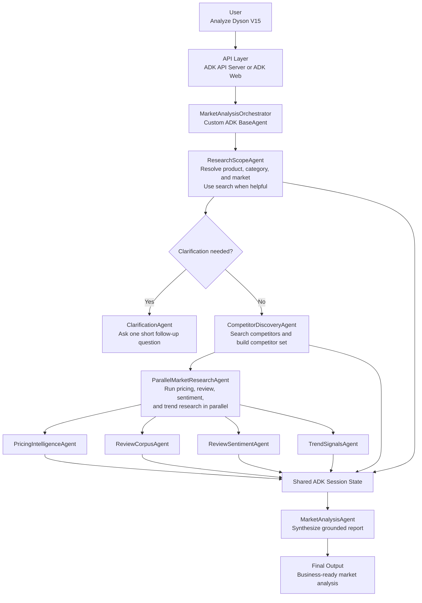
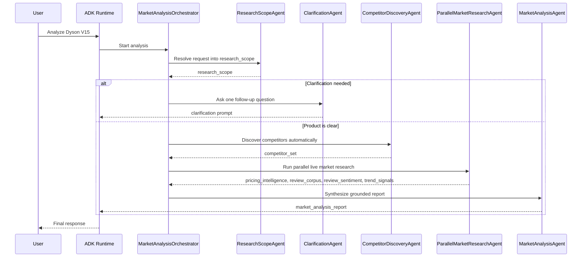

# ECommerce Agents

## Architecture-First README

This repository contains a Google ADK application `ecommerce_agents`. Its job is to turn a simple product request into a structured market-analysis report for an e-commerce team.

It includes the architecture rationale, installation and usage steps, API examples, testing
strategy, a representative generated report, and the written answers to the
theoretical design questions from the assignment.

Example input:

```json
{
  "product": "Dyson V15",
  "market": "CA"
}
```

or simply:

```text
Analyze Dyson V15
```

The active runtime flow is:

```text
MarketAnalysisOrchestrator
  -> ResearchScopeAgent
  -> ClarificationAgent (only if needed)
  -> CompetitorDiscoveryAgent
  -> ParallelMarketResearchAgent
  -> MarketAnalysisAgent
```

The system should automatically:

- normalize the product name
- infer the brand, category, and target market
- discover the most relevant competitors
- gather live pricing, review, sentiment, and trend signals
- synthesize one final market report

The user should not have to explain how competitor discovery works or how the research should be run. The system should ask a follow-up question only when the product request is genuinely ambiguous.

## Start 

To run the app :

1. Open `docker-compose.yml`.
2. Go to the shared `x-app-common.environment` section.
3. Replace:

```text
GOOGLE_API_KEY: GEMINI_API_KEY_HERE
```

with a valid Gemini API key.

Important: this line is declared only once under `x-app-common`, so it is
shared by the web UI, the API container, and the test runner. Reviewers do not
need to edit any other file to make the app start.

Tr run:

```bash
docker compose --profile web up --build market-analysis-web
```

And open:

```text
http://localhost:8001
```

If the API key is changed after the first run, recreate the container so the
new environment value is loaded:

```bash
docker compose --profile web up -d --build --force-recreate market-analysis-web
```

## Product Goal

The goal is to build a market-intelligence assistant for e-commerce teams. Given a product name, the system should produce a useful business report covering:

- product positioning
- likely competitors
- pricing and offer signals
- customer sentiment
- market trends
- actionable recommendations

This architecture prioritizes:

- a simple user experience
- predictable orchestration
- explicit state handoffs between stages
- easy testing and inspection
- extensibility for future API-backed providers

## User Experience

The intended user flow is minimal:

1. The user submits a product name.
2. The system resolves the exact product and market context.
3. The system asks one short clarification question only if the request is unclear.
4. The system discovers competitors automatically.
5. The system runs live market research.
6. The user receives one final report.

Examples:

- `Analyze Dyson V15` -> likely no clarification required
- `Analyze AirPods` -> clarification may be required because multiple models exist
- `Hello` -> the system should ask which product the user wants analyzed

## Recommended Architecture

### Decision

The current recommended solution is a small ADK multi-agent system with explicit branching and a parallel live-research stage.

### Why this architecture

The current architecture follows the ADK patterns that best fit the business goal:

- a custom `BaseAgent` orchestrator for conditional control flow
- a search-capable `ResearchScopeAgent` to resolve the request into structured state
- a dedicated `ClarificationAgent` for one short follow-up question when the scope is unclear
- a search-capable `CompetitorDiscoveryAgent` that derives its own queries from the resolved scope
- a workflow `ParallelAgent` that runs independent research branches concurrently
- a final synthesis agent that writes the user-facing report from session state

Aligns well with the ADK documentation:

- custom agents are the right fit when orchestration depends on runtime conditions and session state
- `ParallelAgent` is the right fit when downstream tasks are independent and benefit from concurrency
- this project still keeps `google_search` isolated in specialist agents as a conservative design choice, even though newer ADK Python versions provide more flexibility than the older integration docs describe
- the current Gemini API docs document Search grounding support on Gemini 3.1 Pro Preview, so this project now defaults to `gemini-3.1-pro-preview` for live search-grounded research

### Why Google ADK instead of a simpler approach

Choosing Google ADK here is deliberate. The problem is not just to send one
prompt to a model and return text. The application needs conditional
clarification, structured shared state, automatic competitor discovery, parallel
research branches, and the ability to expose the same workflow through both a
web UI and an API.

Compared with a more hand-rolled Python orchestration layer or a lighter
single-agent setup, ADK removes a large amount of glue code around:

- routing between agents
- shared session state
- event streaming
- parallel execution
- exposing the workflow through standard runtime surfaces such as ADK Web and
  ADK API Server

This is also the more scalable architectural choice for the future of the
project. If the app evolves, it will be easier:

- to add a new specialist agent simply 
- to replace one research branch with a dedicated tool or API-backed provider
- to introduce caching, job queues, or async execution later
- to preserve a clean separation between orchestration, data acquisition, and
  final synthesis
- to observe behavior at the session, event, and agent-output level

In other words, ADK gives the project better functional scalability: the
workflow can grow in complexity without turning into a fragile chain of manual
conditions and model calls. Production scalability will still require the usual
supporting layers such as stronger persistence, caching, monitoring, and
possibly async processing, but ADK already provides a cleaner and more
extensible orchestration foundation than more minimal alternatives.

### Recommended orchestration pattern

```text
MarketAnalysisOrchestrator(
  ResearchScope
  -> Clarification if needed
  -> Competitor Discovery
  -> Parallel Market Research
  -> Final Analysis
)
```
## Specialized Tool Layer

This submission implements four specialized tools as modular business components:

- pricing_intelligence
- review_corpus
- review_sentiment
- trend_signals

These tools are independently testable and define the structured market-analysis capabilities of the system. The current live ADK runtime is agent-orchestrated: specialist agents use search-grounded research to search evidence and write structured outputs into session state, while the tool layer provides a stable, deterministic abstraction for testing, validation, and future provider-backed integrations.

This is intentional. Agents are responsible for orchestration and end-to-end
workflow control, while tools represent the reusable specialized analysis
capabilities required by the assignment.

In other words, the architecture separates orchestration from capability
implementation: agents coordinate the workflow, and tools define the
specialized functions.

The active ADK runtime is currently agent-first. In the live execution path, the
specialist agents use `google_search` to search grounded evidence, while the
tool layer remains available as the modular capability layer for testing,
deterministic validation, and future integration with structured e-commerce
data sources.

The repository still contains local Python functions in `agents/ecommerce_agents/tools.py` and fixture-backed providers in `agents/ecommerce_agents/providers/mock.py`, but those are no longer the primary execution path of the ADK app. The running workflow now uses search-capable specialist agents to search live evidence and stores their outputs directly in session state.

Those local tools still matter for two reasons:

- they provide deterministic structures for unit tests and local fixture-based validation
- they offer a clean staging point if the project later adds API-backed providers behind Python function tools

### Alternatives considered

- **Single agent**: simpler on paper, but weaker control over clarification, scoping, and grounded competitor discovery.
- **Only workflow agents**: not enough because the application needs explicit branching based on `research_scope` and clarification rules.
- **Many more specialist agents**: possible, but unnecessary beyond the current live-research split.
- **Function-tool-only research**: useful for deterministic integrations later, but not the current runtime architecture.

## Deliverable Coverage

The assignment asks for implementation of steps 1 to 3 in code and for written
answers to steps 4 to 7 in the README. The current repository is structured that
way:

| Requirement | Current solution |
| --- | --- |
| Framework or native orchestration | Google ADK with a custom `BaseAgent` orchestrator |
| Main orchestrator | `MarketAnalysisOrchestrator` |
| Modular tools | `pricing_intelligence`, `review_corpus`, `review_sentiment`, `trend_signals` |
| REST API | ADK API server on `http://localhost:8000` |
| Containerization | `Dockerfile` and `docker-compose.yml` |
| Tests | Unit tests for tools, routing, orchestration, storage, and error handling |
| Example report | Included later in this README |
| Theory answers for steps 4 to 7 | Included later in this README |

The code intentionally focuses on steps 1 to 3 of the assignment. The sections
later in this README for steps 4 to 7 are design recommendations and production
architecture guidance, not claims that those capabilities are already fully
implemented in the current codebase.

## High-Level Components

| Component | ADK Type | Responsibility | Main Output |
| --- | --- | --- | --- |
| `MarketAnalysisOrchestrator` | custom `BaseAgent` | Coordinates scope resolution, clarification, competitor discovery, parallel research, and final synthesis | final report |
| `ResearchScopeAgent` | `LlmAgent` with `google_search` | Resolves the user request into a structured scope and flags clarification when needed | `research_scope` |
| `ClarificationAgent` | `LlmAgent` | Asks one short follow-up question when the request is unclear | user clarification |
| `CompetitorDiscoveryAgent` | `LlmAgent` with `google_search` | Finds the most relevant competitors for the resolved product | `competitor_set` |
| `ParallelMarketResearchAgent` | workflow `ParallelAgent` | Runs pricing, review, sentiment, and trend research concurrently | branch outputs in session state |
| `PricingIntelligenceAgent` | `LlmAgent` with `google_search` | Search live pricing signals for the main product and competitors | `pricing_intelligence` |
| `ReviewCorpusAgent` | `LlmAgent` with `google_search` | Search live review-source evidence for the main product and competitors | `review_corpus` |
| `ReviewSentimentAgent` | `LlmAgent` with `google_search` | Search live praise themes, pain points, and sentiment signals | `review_sentiment` |
| `TrendSignalsAgent` | `LlmAgent` with `google_search` | Search live demand and category trend signals | `trend_signals` |
| `MarketAnalysisAgent` | `LlmAgent` | Synthesizes the gathered state into the final Markdown report | final markdown report |

The app name served by ADK is `ecommerce_agents`, and `root_agent` exports the orchestrator.

## Session State Contracts

The system relies on explicit state handoffs between stages. The most important session-state keys are:

| State Key | Produced By | Purpose |
| --- | --- | --- |
| `research_scope` | `ResearchScopeAgent` | Normalized product scope used for routing and downstream prompts |
| `competitor_set` | `CompetitorDiscoveryAgent` | Structured competitor list used by all research branches |
| `pricing_intelligence` | `PricingIntelligenceAgent` | Live pricing evidence for the product and competitors |
| `review_corpus` | `ReviewCorpusAgent` | Review-source evidence and rating/volume signals |
| `review_sentiment` | `ReviewSentimentAgent` | Praise themes, pain points, and sentiment summary |
| `trend_signals` | `TrendSignalsAgent` | Category demand and market-trend signals |
| `final_report` | `MarketAnalysisAgent` | Final Markdown report used for durable persistence and user output |

Completed analyses are also saved to a lightweight SQLite store after the full
analysis path succeeds. Clarification-only runs are not persisted. The durable
record keeps request metadata, the final Markdown report, a JSON snapshot of the
main session-state outputs, and any source URLs that can be extracted from that
snapshot.

Representative state shapes:

### Example `research_scope`

```json
{
  "canonical_product_name": "Dyson V15 Detect",
  "brand": "Dyson",
  "category": "cordless stick vacuum",
  "market": "CA",
  "requires_clarification": false,
  "resolution_confidence": 0.93
}
```

### Example `competitor_set`

```json
{
  "primary_product": "Dyson V15 Detect",
  "competitors": [
    {
      "brand": "Shark",
      "model": "Detect Pro",
      "confidence": 0.91
    },
    {
      "brand": "Tineco",
      "model": "Pure One S15",
      "confidence": 0.88
    },
    {
      "brand": "Samsung",
      "model": "Bespoke Jet",
      "confidence": 0.82
    }
  ]
}
```

### Example `pricing_intelligence`

```json
{
  "currency": "USD",
  "primary_product": "Dyson V15 Detect",
  "products": [
    {
      "product": "Dyson V15 Detect",
      "msrp_when_found": {
        "amount": 749.99,
        "source": "official Dyson listing"
      },
      "representative_prices": [
        {
          "seller": "Dyson",
          "price": 699.99,
          "availability": "in stock"
        },
        {
          "seller": "Best Buy",
          "price": 679.99,
          "availability": "in stock"
        }
      ],
      "pricing_summary": "Observed offers cluster below MSRP across major retailers.",
      "source_notes": [
        "Official brand listing used to anchor MSRP.",
        "Retailer listings used for current sale pricing."
      ],
      "freshness_note": "Signals were gathered from live web research during the run."
    }
  ]
}
```

## Architecture Schema



## Orchestrator Model



## Agent Behavior

### 1. ResearchScopeAgent

**Role**

Transforms a simple user request into a structured research scope.

**What it does**

- resolves the canonical product name
- infers the brand, category, and market
- uses `google_search` when it helps confirm the product or detect ambiguity
- sets `requires_clarification` and `resolution_confidence`
- does not identify competitors

### 2. ClarificationAgent

**Role**

Asks one short, concrete follow-up question when the request is ambiguous.

**What it does**

- reads `research_scope` from session state
- asks for the missing detail needed to continue
- does not run search
- does not generate a market report

This separation keeps clarification conversational and predictable instead of hiding it behind a tool.

### 3. CompetitorDiscoveryAgent

**Role**

Finds the most relevant competitors for the resolved product.

**How it works**

It derives its own search queries from `research_scope`. For `Dyson V15 Detect`, those queries may resemble:

- `Dyson V15 Detect competitors`
- `best premium cordless stick vacuums`
- `alternatives to Dyson V15 Detect`
- `Dyson V15 vs Shark Detect Pro`
- `Dyson V15 vs Tineco Pure One S15`

It then ranks candidates using:

- category similarity
- price-band proximity
- use-case similarity
- repetition across sources

### 4. ParallelMarketResearchAgent

**Role**

Runs four live research branches concurrently once the product scope and competitor set are stable.

**Why this stage exists**

According to the ADK `ParallelAgent` model, parallel branches are most useful when the work is independent. That matches this stage well because pricing, review evidence, sentiment signals, and trend signals can all be gathered separately after competitor discovery.

**Important ADK behavior**

Parallel sub-agents do not automatically share branch-to-branch history during execution. Each branch writes its own output back to session state, and the final synthesis agent reconciles those results afterward.

**Outputs written to state**

- `pricing_intelligence`
- `review_corpus`
- `review_sentiment`
- `trend_signals`

### 5. MarketAnalysisAgent

**Role**

Synthesizes `research_scope`, `competitor_set`, `pricing_intelligence`, `review_corpus`, `review_sentiment`, and `trend_signals` into the final Markdown report.

**Why synthesis stays separate**

This keeps the report grounded in already-collected evidence and avoids mixing live search behavior into the final reporting step.

## Live Research Strategy

The current runtime uses four specialist research branches after competitor discovery.

### Pricing branch

`PricingIntelligenceAgent` gathers live pricing signals for the primary product and competitors.

It prioritizes:

- official brand pages for MSRP or list-price signals
- major retailers for current observed prices
- freshness notes and source context for downstream synthesis

### Review-evidence branch

`ReviewCorpusAgent` gathers review-source evidence for the primary product and competitors.

It focuses on:

- review sources worth trusting
- rating and review-volume signals
- concise highlights rather than long quoted passages

### Sentiment branch

`ReviewSentimentAgent` gathers customer praise themes, pain points, and overall sentiment signals.

This branch is intentionally separate from `ReviewCorpusAgent`. In the current runtime, sentiment is gathered as its own live-search evidence stream rather than being computed from a single normalized review corpus.

### Trend branch

`TrendSignalsAgent` gathers category-level demand and market-trend signals.

It focuses on:

- demand direction
- price pressure
- category momentum
- supporting signals that help the final report explain the market context

## Specialized Tools Implemented

The repository implements the following specialized Python tools:

- `pricing_intelligence`
- `review_corpus`
- `review_sentiment`
- `trend_signals`

in `agents/ecommerce_agents/tools.py`, along with fixture-backed providers in
`agents/ecommerce_agents/providers/mock.py`.

Tools:

| Tool | Purpose | Current role |
| --- | --- | --- |
| `pricing_intelligence` | Normalizes price and offer data by product | Deterministic validation and future hybrid runtime |
| `review_corpus` | Collects review-source evidence | Deterministic validation and future hybrid runtime |
| `review_sentiment` | Extracts praise themes, pain points, and polarity | Deterministic validation and future hybrid runtime |
| `trend_signals` | Summarizes category demand and price pressure | Deterministic validation and future hybrid runtime |

Those modules are real, tested, and production-shaped 
The local tools are not the active ADK execution path today because the current runtime prioritizes search-grounded multi-agent orchestration to demonstrate end-to-end market research behavior in Google ADK. The tool layer is still implemented and tested as the modular capability layer for deterministic validation and future provider-backed integrations.

Their current purpose is:

- deterministic unit testing
- stable local data-shape validation
- scaffolding for a future API-backed or hybrid tool layer

A good future direction is to let the live search branches discover evidence and
then gradually replace the highest-value branches with API-backed providers
where structured freshness and source control are stronger.

## Example End-to-End Behavior

### User input

```text
Analyze Dyson V15
```

### Internal system behavior

1. The system resolves `Dyson V15` into `Dyson V15 Detect`.
2. The system identifies the category as `cordless stick vacuum`.
3. The system discovers likely competitors automatically.
4. The parallel research stage gathers pricing, review, sentiment, and trend signals.
5. The final analysis agent synthesizes those grounded inputs into one report.

### Representative generated report

The following Markdown block is a real example captured from a successful local
run for the request `iMac`. I kept the shorter Dyson walkthrough above as the
easy architecture example, but this report is a stronger reviewer-facing sample
because it shows the actual synthesis quality of the current runtime.

This example is included directly in the README so the submission satisfies the
deliverable asking for an example generated report without requiring the
reviewer to open another file.

For reviewers who want the raw captured runtime artifact, the full exported ADK
session for this example is also available in
`session-dea91c0c-fd25-4396-9bbb-cb572080cd8e.json`. That JSON includes the
resolved state, intermediate research outputs, final report, and recorded
events for the run.

```md
# iMac Market Analysis Report

## executive_summary
The Apple iMac continues to occupy a dominant position in the premium All-in-One
(AIO) desktop market, largely propelled by its distinct minimalist design, 4.5K
Retina display, and the highly efficient Apple Silicon (M-series)
architecture. Synthesis of recent market data indicates that while the iMac
holds strong brand loyalty and high overall customer satisfaction, it faces
emerging pressure from premium Windows AIOs focusing on touchscreen
capabilities and ergonomic flexibility. Furthermore, shifting consumer
expectations regarding base memory (RAM) and the desire for larger screen form
factors present distinct vulnerabilities in the current 24-inch lineup.

## competitor_landscape
The competitive set for the iMac consists of both volume-driven consumer AIOs
and specialized premium creative workstations. Key rivals include:
* **HP Envy AIO & Dell Inspiron 24/27 AIO:** These represent the primary volume
  competitors. They offer larger screen options and competitive processing
  power at a lower entry price, appealing to budget-conscious home office
  users.
* **Lenovo Yoga AIO 9i:** A direct competitor in the premium design space. It
  challenges the iMac's aesthetic dominance with a sleek, architectural build
  and offers 4K displays with robust internal specifications.
* **Microsoft Surface Studio 2+:** Targeted at creative professionals, this
  device competes with the iMac on premium build quality and display
  excellence. Note on uncertainty: Evidence is mixed on whether consumers
  directly cross-shop the Surface Studio 2+ with the standard iMac, given the
  Surface's significantly higher price point and specialized touchscreen/hinge
  mechanics.

## pricing_summary
Pricing intelligence reveals that the iMac sits firmly in the premium tier of
the consumer AIO market.
* **iMac Pricing:** The base model currently starts at $1,299. However, Apple's
  upgrade pricing structure is steep, with memory and storage upgrades quickly
  pushing the system into the $1,699 to $1,899 range.
* **Competitor Pricing:** The broader PC AIO market averages between $800 and
  $1,100. Competitors like Dell and HP offer 16GB of RAM and 1TB of storage at
  price points where the iMac still provides 8GB of RAM and 256GB of storage.
* **Value Perception:** Despite the premium, the iMac's total cost of ownership
  is often perceived favorably due to high resale value and bundled
  peripherals, though the base model's specification limits its perceived value
  among power users.

## customer_sentiment
Analysis of the review corpus highlights a polarized but generally positive
customer sentiment.
* **Positive Drivers:** The 4.5K Retina display is universally praised for its
  color accuracy and brightness. Users are highly satisfied with the M-series
  chip performance, noting the system's speed, efficiency, and virtually silent
  operation. The slim profile and vibrant color options remain a major
  purchasing driver for home users.
* **Negative Drivers:** The most significant source of negative sentiment
  surrounds the base model's 8GB of unified memory, which many reviewers and
  users feel is inadequate for a machine in this price bracket. Additionally,
  ergonomic limitations and the persistent frustration over the Magic Mouse's
  bottom-facing charging port are frequently cited pain points.

## market_trends
Several overarching trend signals are actively shaping the AIO desktop market:
* **The AI PC Era:** There is a heavy industry-wide shift toward marketing AI
  capabilities. With the rollout of Apple Intelligence on macOS, consumers are
  increasingly evaluating desktop purchases based on on-device machine learning
  performance.
* **Desire for Larger Displays:** Trend signals indicate strong consumer demand
  for 27-inch and 32-inch form factors. The current limitation of the iMac to a
  24-inch model is driving some prosumer demographics toward Mac Mini setups
  paired with external monitors.
* **Market Growth Constraints:** Note on uncertainty: Market signals are mixed
  regarding the long-term growth of the AIO category. While remote work
  initially boosted AIO sales, the increasing power of laptops coupled with
  single-cable docking solutions is actively cannibalizing traditional desktop
  market share.

## recommendations
1. **Revise Base Specifications:** Raise the baseline memory for the entry-level
   iMac from 8GB to 16GB.
2. **Expand Form Factor Options:** Reintroduce a larger 27-inch or 32-inch
   variant to recapture the prosumer market.
3. **Peripheral Redesign:** Redesign the Magic Mouse to allow simultaneous use
   and charging, and offer a height-adjustable stand option.
4. **Lean into Apple Intelligence Marketing:** Emphasize the localized privacy
   and speed of the M-series Neural Engine against competitor AI PCs.
```

## Technical Direction

### Runtime target

- **Language**: Python 3.12
- **Framework**: Google ADK
- **App name**: `ecommerce_agents`
- **Default model**: `gemini-3.1-pro-preview`
- **Runtime surfaces**: ADK API Server and ADK Web UI
- **Local startup target**: Docker Compose on macOS and Windows

## Local Container Startup

The scaffold runs through Docker Compose so the same workflow works on macOS and Windows. The API service, ADK web UI, and test runner all reuse the same image.

### 1. Runtime environment

For the fastest local run, edit `docker-compose.yml` in
`x-app-common.environment` and replace:

```text
GOOGLE_API_KEY: GEMINI_API_KEY_HERE
```

with a valid Gemini API key, then rebuild the container.

That declaration is shared by all Compose services, so one change covers:

- `market-analysis-web`
- `market-analysis-agent`
- `market-analysis-test`

The important reviewer-facing point is that there is no second config file to
edit in order to provide the key.

In the compose file, the runtime also supports these optional values:

- `ADK_MODEL`
- `DEFAULT_MARKET`
- `ANALYSIS_DB_PATH` 

If `ANALYSIS_DB_PATH` is not set, the app defaults to a repo-local SQLite file
at `.adk/analysis_history.db`.

### 2. Model selection

The project now defaults to `gemini-3.1-pro-preview`. As of March 10, 2026, the Gemini API models page deprecates Gemini 3 Pro Preview and points developers to Gemini 3.1 Pro Preview. The dedicated Gemini 3.1 Pro Preview model page, last updated March 18, 2026, lists Search grounding as supported, so this repository uses that newer model for live grounded research.

### 3. Optional preflight check

Before the first boot, you can validate the Compose file without starting containers:

```bash
docker compose config
```

### 4. Helper scripts

If you want shorter commands, use the helper scripts.

Windows:

```cmd
scripts\adk.cmd init-env
scripts\adk.cmd config
scripts\adk.cmd web -Build
scripts\adk.cmd api -Build
scripts\adk.cmd test
```

macOS and Linux:

```bash
bash scripts/adk.sh init-env
bash scripts/adk.sh config
bash scripts/adk.sh web --build
bash scripts/adk.sh api --build
bash scripts/adk.sh test
```

### 5. Daily development mode with ADK Web

For day-to-day development, start the web UI first:

```bash
docker compose --profile web up --build market-analysis-web
```

Then open:

```text
http://localhost:8001
```

Inside the UI, select the `ecommerce_agents` app.

### 6. API testing mode

When you want to validate the REST integration path, start the API server:

```bash
docker compose up --build market-analysis-agent
```

Useful endpoints:

- `http://localhost:8000/docs`
- `http://localhost:8000/list-apps`

`/list-apps` should include `ecommerce_agents`.

When calling the API directly, use:

```json
{
  "appName": "ecommerce_agents"
}
```

Representative request bodies are:

Create a session:

```json
{}
```

Run an analysis:

```json
{
  "appName": "ecommerce_agents",
  "userId": "u_123",
  "sessionId": "s_123",
  "newMessage": {
    "role": "user",
    "parts": [
      {
        "text": "Analyze Dyson V15"
      }
    ]
  }
}
```

Representative HTTP request example:

```bash
curl -X POST http://localhost:8000/run \
  -H "Content-Type: application/json" \
  -d '{
    "appName": "ecommerce_agents",
    "userId": "u_123",
    "sessionId": "s_123",
    "newMessage": {
      "role": "user",
      "parts": [
        {
          "text": "Analyze Dyson V15"
        }
      ]
    }
  }'
```

### 7. Run tests in the container

Use the dedicated test service:

```bash
docker compose --profile test run --rm market-analysis-test
```

or run tests inside the running web container:

```bash
docker compose exec market-analysis-web pytest -q
```

### 8. Testing

The current automated suite focuses on the parts of the app that are the most
important and the most fragile in a multi-agent ADK workflow:

- agent construction and wiring
- request parsing and routing
- orchestrator behavior
- deterministic tool and provider outputs
- durable SQLite persistence
- basic repository/documentation presence

These tests were chosen because they protect the business-critical path of the
application. If agent wiring breaks, the app does not start. If routing breaks,
the app asks the wrong question or analyzes the wrong product. If orchestration
breaks, the clarification branch, competitor discovery, or final synthesis can
fail silently. If storage breaks, completed analyses are lost or overwritten.

#### Why each test group is relevant

- `tests/test_agent_definition.py`
  - Checks that the ADK graph imports cleanly and that the expected agents are
    present.
  - This is relevant because bad agent wiring prevents the whole runtime from
    loading.
- `tests/test_agent_orchestration.py`
  - Checks the custom orchestrator flow, especially progress events and the
    clarification branch.
  - This is relevant because orchestration is the core logic of the app.
- `tests/test_config.py`
  - Checks default model, default market, and the SQLite path.
  - This is relevant because broken defaults fail before the user can even run
    an analysis.
- `tests/test_routing.py`
  - Checks scope parsing, clarification detection, fenced JSON handling, and
    fallback behavior.
  - This is relevant because every request passes through routing first.
- `tests/test_tools.py`
  - Checks the pricing, review, sentiment, and trend tool wrappers.
  - This is relevant because those helpers define the expected structure of
    downstream market data.
- `tests/test_mock_providers.py`
  - Checks the fixture-backed mock providers.
  - This is relevant because they give deterministic local validation without
    depending on external APIs.
- `tests/test_storage.py`
  - Checks snapshot creation and SQLite save/read behavior.
  - This is relevant because completed analyses now need durable storage.
- `tests/test_persistence_flow.py`
  - Checks the end-to-end persistence rules from the orchestrator.
  - This is relevant because successful runs must persist, clarification-only
    runs must not persist, and storage failures must not block the final answer.
- `tests/test_readme_exists.py`
  - Checks that the repository still contains its main documentation file.
  - This is relevant because the assignment requires a runnable and documented
    submission.

#### Declared automated tests

- `tests/test_agent_definition.py`
  - `test_root_agent_and_parallel_research_agents_import_cleanly`
- `tests/test_agent_orchestration.py`
  - `test_internal_research_events_are_hidden_but_progress_is_visible`
  - `test_clarification_branch_keeps_follow_up_visible`
- `tests/test_config.py`
  - `test_default_market_matches_architecture_examples`
  - `test_default_model_uses_gemini_3_1_pro_preview_for_search_grounding`
  - `test_analysis_db_path_defaults_to_repo_local_adk_storage`
- `tests/test_routing.py`
  - `test_greeting_scope_requires_clarification`
  - `test_valid_scope_continues_research`
  - `test_parse_research_scope_accepts_fenced_json`
  - `test_invalid_scope_defaults_to_clarification`
- `tests/test_mode.py`
  - `test_normalize_mode_accepts_supported_values_case_insensitively`
  - `test_extract_mode_and_clean_text_handles_inline_mode_selection`
  - `test_extract_mode_and_clean_text_handles_mode_only_messages`
  - `test_mode_messages_reflect_live_key_availability`
- `tests/test_mock_providers.py`
  - `test_mock_pricing_provider_returns_products`
  - `test_mock_review_provider_injects_product_name`
  - `test_mock_trend_provider_formats_summary`
- `tests/test_tools.py`
  - `test_pricing_intelligence_wraps_provider_payload`
  - `test_review_corpus_returns_reviews_by_product`
  - `test_review_sentiment_returns_product_summaries`
  - `test_trend_signals_returns_category_context`
- `tests/test_storage.py`
  - `test_build_analysis_snapshot_extracts_scope_report_and_citations`
  - `test_sqlite_analysis_store_round_trips_snapshots_and_filters_recent`
  - `test_sqlite_analysis_store_keeps_multiple_runs_for_same_session`
- `tests/test_persistence_flow.py`
  - `test_build_analysis_snapshot_from_context_reads_final_report_and_request`
  - `test_full_run_persists_completed_analysis_snapshot`
  - `test_clarification_path_does_not_persist_analysis`
  - `test_persistence_failure_keeps_final_report_in_event_stream`
- `tests/test_readme_exists.py`
  - `test_readme_exists`

`tests/test_mode.py` covers a small parser helper retained from a previous UI
mode-selection exploration. It is currently not part of the active `root_agent`
runtime path, so it should be interpreted as stable utility coverage rather
than as a core execution-path test.

#### Manual tests

These manual checks complement the automated tests by confirming that the
containerized runtime and ADK interfaces work end to end:

1. Validate Compose with `docker compose config`.
2. Start the ADK web UI with `docker compose --profile web up --build market-analysis-web`.
3. Open `http://localhost:8001`.
4. Create a session in the ADK web UI.
5. Send an analysis request and inspect state and event history.
6. Start the ADK API server with `docker compose up --build market-analysis-agent`.
7. Create a session through the API with an empty JSON body.
8. Run an analysis through `/run` with the request body shown in the API section above.
9. Run the containerized automated suite with `docker compose --profile test run --rm market-analysis-test`.

## Error Handling

The current implementation includes a few explicit error-handling decisions that
are important for reviewer understanding:

- if the research scope is ambiguous, the system falls back to a clarification
  question instead of generating a weak report
- clarification-only runs are not persisted in the durable analysis store
- persistence failures are logged, but they do not block the final user-facing
  report from being returned
- invalid or unparseable structured scope output safely falls back to
  clarification behavior

These choices are important because they favor a predictable user experience and
reduce the risk of silently storing incomplete or low-confidence analyses.

## Step 4. Data Architecture and Storage

This section answers the assignment question about how data should be stored and
why.

### Current implemented approach

The current code uses a two-tier storage model:

- transient agent outputs stay in ADK session state
- completed analyses are persisted in SQLite because it keeps the project simple,
  executable, and easy to review.

This is implemented because the two data classes have different lifecycles:

- session state is ideal for short-lived orchestration context during one run
- durable analysis history needs stable records that survive process restarts
 
### Data model

The durable analysis record stores:

| Field | Purpose |
| --- | --- |
| `analysis_id` | Stable identifier for one completed run |
| `session_id` | Session-level grouping |
| `user_id` | User-level grouping |
| `created_at` | Run timestamp |
| `request_text` | Original request text |
| `product_name` | Normalized primary product |
| `category` | Normalized category |
| `market` | Normalized market |
| `status` | Durable record status |
| `final_report_markdown` | Final user-facing report |
| `state_snapshot_json` | JSON snapshot of core intermediate results |
| `citations_json` | Extracted source URLs |

### Recommended production architecture
 
For a production version, I would likely move from SQLite to a document-oriented
database. The main reason is that the application already produces nested
JSON-shaped outputs such as research scope, competitor sets, pricing
intelligence, review sentiment, trend signals, citations, and the final report
snapshot. A document-oriented store fits that structure naturally, reduces the
need to flatten or transform payloads into many relational tables, and makes
schema evolution easier as agent outputs change over time.

This choice also reduces the impedance mismatch between the in-memory ADK
session state and the persisted storage model.
  
## Step 5. Monitoring and Observability

This section answers the assignment question about tracing, metrics, alerting,
and output quality.

### Tracing approach

I would trace each analysis as one parent span with child spans for:

- research scope resolution
- clarification branch if triggered
- competitor discovery
- each parallel research branch
- final synthesis
- persistence

Every span should include:

- `analysis_id`
- `session_id`
- `user_id`
- model name
- market
- product category
- success or failure state

### Performance metrics

The most useful operational metrics are:

- total analysis latency
- latency per stage
- success rate
- clarification rate
- persistence failure rate
- average citations per report
- token usage and estimated model cost per run
- percentage of runs missing one or more branch outputs

### Alerting strategy

I would alert on:

- sustained failure rate above threshold
- persistence failures above threshold
- stage timeouts or unusually high latency
- empty or near-empty final reports
- sudden drop in citation count or branch completion rate

### Measuring output quality

I would track quality using:

- citation count and citation coverage by section
- schema completeness of state outputs
- user feedback scores
- periodic human review of sampled reports
- automated LLM-as-judge scoring for relevance, completeness, and actionability

## Step 6. Scaling and Optimization

This section answers the assignment question about concurrency, cost, caching,
and parallelization.

### Handling 100+ concurrent analyses

For significant load, I would separate the synchronous API layer from the
execution workers:

- API service accepts requests and creates jobs
- a queue distributes jobs to worker containers
- workers run the orchestrator and write progress and final outputs
- autoscaling is driven by queue depth and average execution latency

### Cost optimization

The strongest cost controls are:

- early clarification before expensive downstream research which is already in place 
- caching repeated product and competitor lookups with freshness windows
- reusing normalized competitor sets for repeated products in the same market
- setting hard limits on search breadth and report length
- routing only the highest-value steps to the most expensive models 

### Intelligent caching

I would cache:

- normalized research scopes by request signature
- competitor sets by canonical product plus market
- tool or search results by product plus market plus freshness window
- final reports only when the request is exactly repeated and freshness is still
  acceptable

### Parallelization strategy

The current code already uses a `ParallelAgent` for independent research
branches. That is the right pattern because pricing, review evidence, sentiment,
and trends can run concurrently after competitor discovery is stable.

For larger scale, I would keep this same logical split but place branch workers
behind queue-based execution and per-provider rate limits.

## Known Limitations

The current submission is intentionally scoped to be executable, reviewable, and
focused on orchestration. Reviewers should be aware of these limits:

- live analysis depends on a valid Gemini API key
- live grounded outputs depend on external search availability and freshness
- the specialized Python tool layer is implemented and tested, but the active
  live runtime currently uses search-grounded specialist agents rather than the
  local tool functions for end-to-end execution
- production monitoring, autoscaling, and A/B evaluation are documented in this
  README as design recommendations rather than fully shipped infrastructure

## Step 7. Continuous Improvement and A/B Testing

This section answers the assignment question about quality evaluation, prompt
comparison, user feedback, and iterative capability growth.

### Automatic quality evaluation

I would use a two-layer quality loop:

- deterministic checks for schema completeness, missing citations, and report
  section coverage
- LLM-as-judge scoring for strategic usefulness, factual grounding, clarity, and
  recommendation quality

### Prompt experimentation

Prompt changes should be versioned explicitly. I would compare prompt versions
on a fixed benchmark set of representative product requests and track:

- latency
- token cost
- citation coverage
- judge score
- human preference on sampled outputs

### User feedback loop

The most useful lightweight feedback signals are:

- thumbs up or down on the final report
- optional free-text feedback
- whether the user asks for a regeneration or clarification
- whether the user exports or revisits the result later

### Capability evolution

I would improve the system in this order:

 - strengthen source preservation and citations
 - replace the highest-value mocked or search-heavy branches with structured data providers
 - add confidence and freshness scoring to the final report
 - introduce benchmark datasets and regression evaluation before each release

## Next Development Steps

The most useful next steps now that the parallel live-research flow is in place are:

1. Preserve source URLs and clearer citations from each research branch.
2. Add end-to-end orchestration tests around clarification, competitor discovery, and synthesis.
3. Decide which research branches should stay search-first and which should move to API-backed providers.
4. Add freshness and confidence scoring that the final report can surface explicitly.
5. Keep the fixture-backed tool layer aligned with the live runtime outputs or retire it if it stops adding value. 
6. Add an `Agents to UI` layer so the interface delivers clearer business
   signals, trade-offs, and recommendations and supports more comprehensive
   decision-making.
 

## Trade-Offs

- A multi-agent workflow is more verbose than a single agent, but it is easier to test, inspect, and reason about.
- A dedicated clarification agent adds one more step, but it keeps user follow-ups clean and predictable.
- Parallel research improves latency, but the branches do not automatically share intermediate reasoning while they run.
- Search-based sentiment is flexible, but it is less deterministic than sentiment computed from one normalized review corpus.
- Keeping legacy tools and mock providers helps testing, but it creates a maintenance obligation to keep those structures aligned with the live runtime.

## Summary

The current best-fit architecture for this repository is:

- a simple user-facing experience
- a custom ADK orchestrator for branching logic
- a search-capable research-scoping stage
- a dedicated clarification stage
- automatic competitor discovery
- a parallel live market-research stage for independent research branches
- a final synthesis agent grounded in session state

In summary:

> The user says what product they want to analyze.  
> The system figures out the scope, competitors, live signals, and final report.
 
