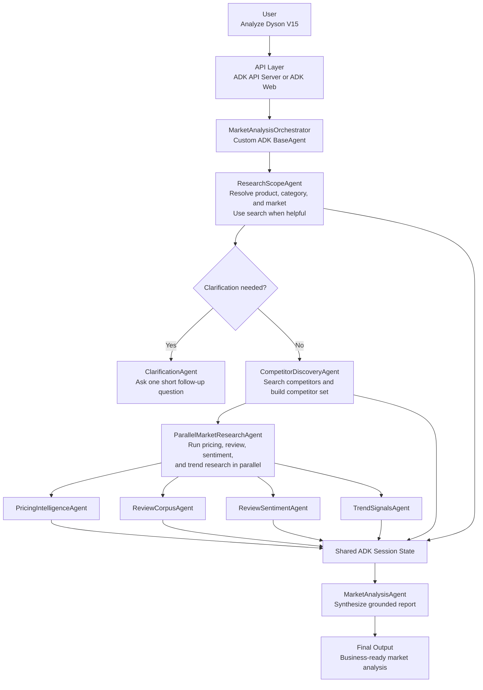
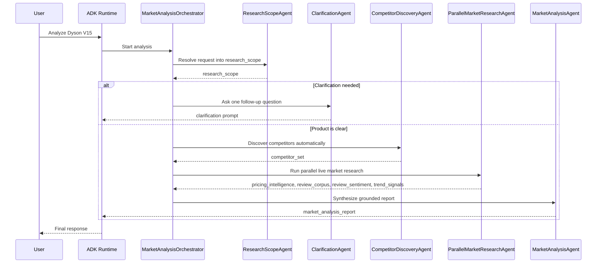

# ECommerce Agents

## Architecture-First README

This repository contains a Google ADK application exposed as `ecommerce_agents`. Its job is to turn a simple product request into a structured market-analysis report for an e-commerce team.

Example input:

```json
{
  "product": "Dyson V15",
  "market": "CA"
}
```

or simply:

```text
Analyze Dyson V15
```

The active runtime flow is:

```text
MarketAnalysisOrchestrator
  -> ResearchScopeAgent
  -> ClarificationAgent (only if needed)
  -> CompetitorDiscoveryAgent
  -> ParallelMarketResearchAgent
  -> MarketAnalysisAgent
```

The system should automatically:

- normalize the product name
- infer the brand, category, and target market
- discover the most relevant competitors
- gather live pricing, review, sentiment, and trend signals
- synthesize one final market report

The user should not have to explain how competitor discovery works or how the research should be run. The system should ask a follow-up question only when the product request is genuinely ambiguous.

## Product Goal

The goal is to build a market-intelligence assistant for e-commerce teams. Given a product name, the system should produce a useful business report covering:

- product positioning
- likely competitors
- pricing and offer signals
- customer sentiment
- market trends
- actionable recommendations

This architecture prioritizes:

- a simple user experience
- predictable orchestration
- explicit state handoffs between stages
- easy testing and inspection
- extensibility for future API-backed collectors

## User Experience

The intended user flow is minimal:

1. The user submits a product name.
2. The system resolves the exact product and market context.
3. The system asks one short clarification question only if the request is unclear.
4. The system discovers competitors automatically.
5. The system runs live market research.
6. The user receives one final report.

Examples:

- `Analyze Dyson V15` -> likely no clarification required
- `Analyze AirPods` -> clarification may be required because multiple models exist
- `Hello` -> the system should ask which product the user wants analyzed

## Recommended Architecture

### Decision

The current recommended solution is a small ADK multi-agent system with explicit branching and a parallel live-research stage.

### Why this architecture

The current implementation follows the ADK patterns that fit the problem best:

- a custom `BaseAgent` orchestrator for conditional control flow
- a search-capable `ResearchScopeAgent` to resolve the request into structured state
- a dedicated `ClarificationAgent` for one short follow-up question when the scope is unclear
- a search-capable `CompetitorDiscoveryAgent` that derives its own queries from the resolved scope
- a workflow `ParallelAgent` that runs independent research branches concurrently
- a final synthesis agent that writes the user-facing report from session state

This design aligns well with the ADK documentation:

- custom agents are the right fit when orchestration depends on runtime conditions and session state
- `ParallelAgent` is the right fit when downstream tasks are independent and benefit from concurrency
- this project still keeps `google_search` isolated in specialist agents as a conservative design choice, even though newer ADK Python versions provide more flexibility than the older integration docs describe
- the current Gemini API docs document Search grounding support on Gemini 3.1 Pro Preview, so this project now defaults to `gemini-3.1-pro-preview` for live search-grounded research

### Recommended orchestration pattern

```text
MarketAnalysisOrchestrator(
  ResearchScope
  -> Clarification if needed
  -> Competitor Discovery
  -> Parallel Market Research
  -> Final Analysis
)
```

### Why this is not a tool-first runtime anymore

The active ADK runtime is now agent-first, not tool-first.

The repository still contains local Python functions in `agents/ecommerce_agents/tools.py` and fixture-backed providers in `agents/ecommerce_agents/providers/mock.py`, but those are no longer the primary execution path of the ADK app. The running workflow now uses search-capable specialist agents to gather live evidence and stores their outputs directly in session state.

Those local tools still matter for two reasons:

- they provide deterministic structures for unit tests and local fixture-based validation
- they offer a clean staging point if the project later adds API-backed collectors behind Python function tools

### Alternatives considered

- **Single agent**: simpler on paper, but weaker control over clarification, scoping, and grounded competitor discovery.
- **Only workflow agents**: not enough because the application needs explicit branching based on `research_scope` and clarification rules.
- **Many more specialist agents**: possible, but unnecessary beyond the current live-research split.
- **Function-tool-only research**: useful for deterministic integrations later, but not the current runtime architecture.

## High-Level Components

| Component | ADK Type | Responsibility | Main Output |
| --- | --- | --- | --- |
| `MarketAnalysisOrchestrator` | custom `BaseAgent` | Coordinates scope resolution, clarification, competitor discovery, parallel research, and final synthesis | final report |
| `ResearchScopeAgent` | `LlmAgent` with `google_search` | Resolves the user request into a structured scope and flags clarification when needed | `research_scope` |
| `ClarificationAgent` | `LlmAgent` | Asks one short follow-up question when the request is unclear | user clarification |
| `CompetitorDiscoveryAgent` | `LlmAgent` with `google_search` | Finds the most relevant competitors for the resolved product | `competitor_set` |
| `ParallelMarketResearchAgent` | workflow `ParallelAgent` | Runs pricing, review, sentiment, and trend research concurrently | branch outputs in session state |
| `PricingIntelligenceAgent` | `LlmAgent` with `google_search` | Search live pricing signals for the main product and competitors | `pricing_intelligence` |
| `ReviewCorpusAgent` | `LlmAgent` with `google_search` | Search live review-source evidence for the main product and competitors | `review_corpus` |
| `ReviewSentimentAgent` | `LlmAgent` with `google_search` | Search live praise themes, pain points, and sentiment signals | `review_sentiment` |
| `TrendSignalsAgent` | `LlmAgent` with `google_search` | Search live demand and category trend signals | `trend_signals` |
| `MarketAnalysisAgent` | `LlmAgent` | Synthesizes the gathered state into the final Markdown report | final markdown report |

The app name served by ADK is `ecommerce_agents`, and `root_agent` exports the orchestrator.

## Session State Contracts

The system relies on explicit state handoffs between stages. The most important session-state keys are:

| State Key | Produced By | Purpose |
| --- | --- | --- |
| `research_scope` | `ResearchScopeAgent` | Normalized product scope used for routing and downstream prompts |
| `competitor_set` | `CompetitorDiscoveryAgent` | Structured competitor list used by all research branches |
| `pricing_intelligence` | `PricingIntelligenceAgent` | Live pricing evidence for the product and competitors |
| `review_corpus` | `ReviewCorpusAgent` | Review-source evidence and rating/volume signals |
| `review_sentiment` | `ReviewSentimentAgent` | Praise themes, pain points, and sentiment summary |
| `trend_signals` | `TrendSignalsAgent` | Category demand and market-trend signals |
| `final_report` | `MarketAnalysisAgent` | Final Markdown report used for durable persistence and user output |

Completed analyses are also saved to a lightweight SQLite store after the full
analysis path succeeds. Clarification-only runs are not persisted. The durable
record keeps request metadata, the final Markdown report, a JSON snapshot of the
main session-state outputs, and any source URLs that can be extracted from that
snapshot.

Representative state shapes:

### Example `research_scope`

```json
{
  "canonical_product_name": "Dyson V15 Detect",
  "brand": "Dyson",
  "category": "cordless stick vacuum",
  "market": "CA",
  "requires_clarification": false,
  "resolution_confidence": 0.93
}
```

### Example `competitor_set`

```json
{
  "primary_product": "Dyson V15 Detect",
  "competitors": [
    {
      "brand": "Shark",
      "model": "Detect Pro",
      "confidence": 0.91
    },
    {
      "brand": "Tineco",
      "model": "Pure One S15",
      "confidence": 0.88
    },
    {
      "brand": "Samsung",
      "model": "Bespoke Jet",
      "confidence": 0.82
    }
  ]
}
```

### Example `pricing_intelligence`

```json
{
  "currency": "USD",
  "primary_product": "Dyson V15 Detect",
  "products": [
    {
      "product": "Dyson V15 Detect",
      "msrp_when_found": {
        "amount": 749.99,
        "source": "official Dyson listing"
      },
      "representative_prices": [
        {
          "seller": "Dyson",
          "price": 699.99,
          "availability": "in stock"
        },
        {
          "seller": "Best Buy",
          "price": 679.99,
          "availability": "in stock"
        }
      ],
      "pricing_summary": "Observed offers cluster below MSRP across major retailers.",
      "source_notes": [
        "Official brand listing used to anchor MSRP.",
        "Retailer listings used for current sale pricing."
      ],
      "freshness_note": "Signals were gathered from live web research during the run."
    }
  ]
}
```

## Architecture Schema



## Orchestrator Model



## Agent Behavior

### 1. ResearchScopeAgent

**Role**

Transforms a simple user request into a structured research scope.

**What it does**

- resolves the canonical product name
- infers the brand, category, and market
- uses `google_search` when it helps confirm the product or detect ambiguity
- sets `requires_clarification` and `resolution_confidence`
- does not identify competitors

### 2. ClarificationAgent

**Role**

Asks one short, concrete follow-up question when the request is ambiguous.

**What it does**

- reads `research_scope` from session state
- asks for the missing detail needed to continue
- does not run search
- does not generate a market report

This separation keeps clarification conversational and predictable instead of hiding it behind a tool.

### 3. CompetitorDiscoveryAgent

**Role**

Finds the most relevant competitors for the resolved product.

**How it works**

It derives its own search queries from `research_scope`. For `Dyson V15 Detect`, those queries may resemble:

- `Dyson V15 Detect competitors`
- `best premium cordless stick vacuums`
- `alternatives to Dyson V15 Detect`
- `Dyson V15 vs Shark Detect Pro`
- `Dyson V15 vs Tineco Pure One S15`

It then ranks candidates using:

- category similarity
- price-band proximity
- use-case similarity
- repetition across sources

### 4. ParallelMarketResearchAgent

**Role**

Runs four live research branches concurrently once the product scope and competitor set are stable.

**Why this stage exists**

According to the ADK `ParallelAgent` model, parallel branches are most useful when the work is independent. That matches this stage well because pricing, review evidence, sentiment signals, and trend signals can all be gathered separately after competitor discovery.

**Important ADK behavior**

Parallel sub-agents do not automatically share branch-to-branch history during execution. Each branch writes its own output back to session state, and the final synthesis agent reconciles those results afterward.

**Outputs written to state**

- `pricing_intelligence`
- `review_corpus`
- `review_sentiment`
- `trend_signals`

### 5. MarketAnalysisAgent

**Role**

Synthesizes `research_scope`, `competitor_set`, `pricing_intelligence`, `review_corpus`, `review_sentiment`, and `trend_signals` into the final Markdown report.

**Why synthesis stays separate**

This keeps the report grounded in already-collected evidence and avoids mixing live search behavior into the final reporting step.

## Live Research Strategy

The current runtime uses four specialist research branches after competitor discovery.

### Pricing branch

`PricingIntelligenceAgent` gathers live pricing signals for the primary product and competitors.

It prioritizes:

- official brand pages for MSRP or list-price signals
- major retailers for current observed prices
- freshness notes and source context for downstream synthesis

### Review-evidence branch

`ReviewCorpusAgent` gathers review-source evidence for the primary product and competitors.

It focuses on:

- review sources worth trusting
- rating and review-volume signals
- concise highlights rather than long quoted passages

### Sentiment branch

`ReviewSentimentAgent` gathers customer praise themes, pain points, and overall sentiment signals.

This branch is intentionally separate from `ReviewCorpusAgent`. In the current runtime, sentiment is gathered as its own live-search evidence stream rather than being computed from a single normalized review corpus.

### Trend branch

`TrendSignalsAgent` gathers category-level demand and market-trend signals.

It focuses on:

- demand direction
- price pressure
- category momentum
- supporting signals that help the final report explain the market context

## Legacy Local Tools And Providers

The repository still includes:

- `pricing_intelligence`
- `review_corpus`
- `review_sentiment`
- `trend_signals`

in `agents/ecommerce_agents/tools.py`, along with fixture-backed providers in `agents/ecommerce_agents/providers/mock.py`.

Those modules are useful, but they are not the active runtime path of the ADK application today.

Their current purpose is:

- deterministic unit testing
- stable local data-shape validation
- scaffolding for a future API-backed or hybrid tool layer

A good future direction is to let the live search branches discover evidence and then gradually replace the highest-value branches with API-backed collectors where structured freshness and source control matter most.

## Example End-to-End Behavior

### User input

```text
Analyze Dyson V15
```

### Internal system behavior

1. The system resolves `Dyson V15` into `Dyson V15 Detect`.
2. The system identifies the category as `cordless stick vacuum`.
3. The system discovers likely competitors automatically.
4. The parallel research stage gathers pricing, review, sentiment, and trend signals.
5. The final analysis agent synthesizes those grounded inputs into one report.

## Technical Direction

### Runtime target

- **Language**: Python 3.12
- **Framework**: Google ADK
- **App name**: `ecommerce_agents`
- **Default model**: `gemini-3.1-pro-preview`
- **Runtime surfaces**: ADK API Server and ADK Web UI
- **Local startup target**: Docker Compose on macOS and Windows

## Local Container Startup

The scaffold runs through Docker Compose so the same workflow works on macOS and Windows. The API service, ADK web UI, and test runner all reuse the same image.

### 1. Runtime environment

The runtime expects these environment variables inside the container:

- `GOOGLE_API_KEY`
- `ADK_MODEL`
- `DEFAULT_MARKET`
- `ANALYSIS_DB_PATH`

For local development, the preferred place for secrets and overrides is `.env`. A minimal example is already provided in `.env.example`.

Typical local values:

```text
GOOGLE_API_KEY=your-google-api-key
ADK_MODEL=gemini-3.1-pro-preview
DEFAULT_MARKET=CA
ANALYSIS_DB_PATH=/app/.adk/analysis_history.db
```

If `ANALYSIS_DB_PATH` is not set, the app defaults to a repo-local SQLite file
at `.adk/analysis_history.db`.

### 2. Model selection

The project now defaults to `gemini-3.1-pro-preview`. As of March 10, 2026, the Gemini API models page deprecates Gemini 3 Pro Preview and points developers to Gemini 3.1 Pro Preview. The dedicated Gemini 3.1 Pro Preview model page, last updated March 18, 2026, lists Search grounding as supported, so this repository uses that newer model for live grounded research.

### 3. Optional preflight check

Before the first boot, you can validate the Compose file without starting containers:

```bash
docker compose config
```

### 4. Helper scripts

If you want shorter commands, use the helper scripts.

Windows:

```cmd
scripts\adk.cmd init-env
scripts\adk.cmd config
scripts\adk.cmd web -Build
scripts\adk.cmd api -Build
scripts\adk.cmd test
```

macOS and Linux:

```bash
bash scripts/adk.sh init-env
bash scripts/adk.sh config
bash scripts/adk.sh web --build
bash scripts/adk.sh api --build
bash scripts/adk.sh test
```

### 5. Daily development mode with ADK Web

For day-to-day development, start the web UI first:

```bash
docker compose --profile web up --build market-analysis-web
```

Then open:

```text
http://localhost:8001
```

Inside the UI, select the `ecommerce_agents` app.

### 6. API testing mode

When you want to validate the REST integration path, start the API server:

```bash
docker compose up --build market-analysis-agent
```

Useful endpoints:

- `http://localhost:8000/docs`
- `http://localhost:8000/list-apps`

`/list-apps` should include `ecommerce_agents`.

When calling the API directly, use:

```json
{
  "appName": "ecommerce_agents"
}
```

### 7. Run tests in the container

Use the dedicated test service:

```bash
docker compose --profile test run --rm market-analysis-test
```

or run tests inside the running web container:

```bash
docker compose exec market-analysis-web pytest -q
```

### 8. When do we need to rebuild?

You need `--build` again when you change:

- `pyproject.toml`
- `Dockerfile`
- installed Python dependencies
- system-level dependencies

You usually do not need to rebuild when you change:

- `agent.py`
- `prompts.py`
- `routing.py`
- tests
- fixture data
- docs

### 9. What if reload does not pick up a change?

Use a restart instead of a rebuild:

```bash
docker compose restart market-analysis-web
```

### 10. Smoke-test assets

A step-by-step checklist is available in [docs/SMOKE_TEST.md](docs/SMOKE_TEST.md).

Ready-made API payloads are available in:

- [examples/api/create-session-state.json](examples/api/create-session-state.json)
- [examples/api/run-analysis.json](examples/api/run-analysis.json)

## Next Development Steps

The most useful next steps now that the parallel live-research flow is in place are:

1. Preserve source URLs and clearer citations from each research branch.
2. Add end-to-end orchestration tests around clarification, competitor discovery, and synthesis.
3. Decide which research branches should stay search-first and which should move to API-backed collectors.
4. Add freshness and confidence scoring that the final report can surface explicitly.
5. Keep the fixture-backed tool layer aligned with the live runtime outputs or retire it if it stops adding value.

## Trade-Offs

- A multi-agent workflow is more verbose than a single agent, but it is easier to test, inspect, and reason about.
- A dedicated clarification agent adds one more step, but it keeps user follow-ups clean and predictable.
- Parallel research improves latency, but the branches do not automatically share intermediate reasoning while they run.
- Search-based sentiment is flexible, but it is less deterministic than sentiment computed from one normalized review corpus.
- Keeping legacy tools and mock providers helps testing, but it creates a maintenance obligation to keep those structures aligned with the live runtime.

## Recommendation Summary

The current best-fit architecture for this repository is:

- a simple user-facing experience
- a custom ADK orchestrator for branching logic
- a search-capable research-scoping stage
- a dedicated clarification stage
- automatic competitor discovery
- a parallel live market-research stage
- a final synthesis agent grounded in session state

In short:

> The user says what product they want to analyze.  
> The system figures out the scope, competitors, live signals, and final report.
 
