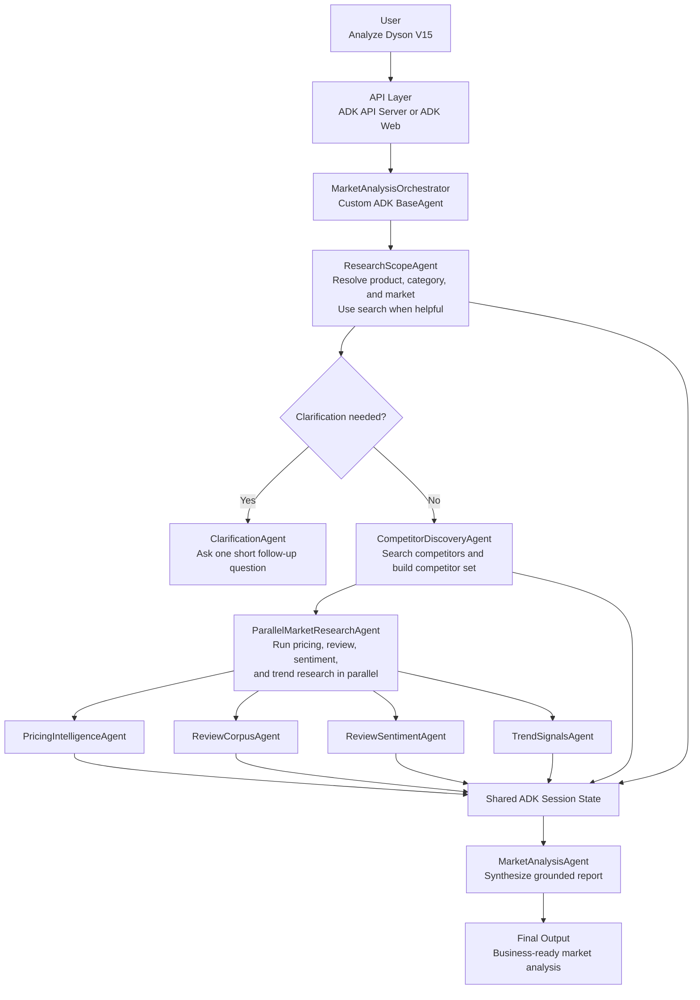
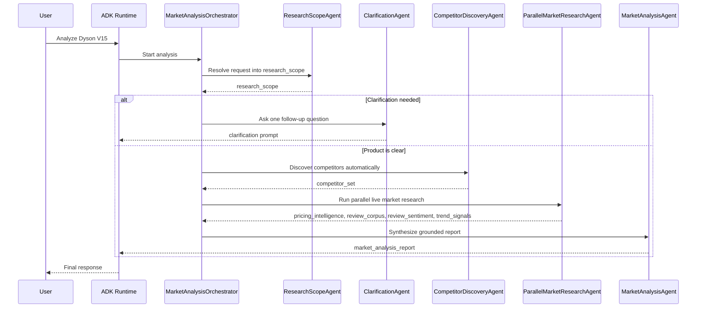

# ECommerce Agents

## Architecture

Ce dépôt contient une application Google ADK exposée sous le nom
`ecommerce_agents`. Son objectif est de transformer une demande produit simple
en un rapport structuré d'analyse de marché pour une équipe e-commerce.

Ce README est volontairement autonome pour l'évaluation. Il regroupe la
justification d'architecture, les étapes d'installation et d'utilisation, des
exemples d'API, la stratégie de test, un exemple représentatif de rapport
généré, ainsi que les réponses rédigées aux questions théoriques du test.

Exemple d'entrée :

```json
{
  "product": "Dyson V15",
  "market": "CA"
}
```

ou simplement :

```text
Analyze Dyson V15
```

Le flux d'exécution actif est le suivant :

```text
MarketAnalysisOrchestrator
  -> ResearchScopeAgent
  -> ClarificationAgent (only if needed)
  -> CompetitorDiscoveryAgent
  -> ParallelMarketResearchAgent
  -> MarketAnalysisAgent
```

Le système doit automatiquement :

- normaliser le nom du produit
- déduire la marque, la catégorie et le marché cible
- découvrir les concurrents les plus pertinents
- collecter des signaux en direct de prix, d'avis, de sentiment et de tendance
- synthétiser un rapport final d'analyse de marché

L'utilisateur ne doit pas avoir à expliquer comment fonctionne la découverte des
concurrents ni comment la recherche doit être conduite. Le système ne doit
poser une question complémentaire que lorsque la demande produit est réellement
ambiguë.

## Objectif produit

L'objectif est de construire un assistant d'intelligence de marché pour des
équipes e-commerce. À partir d'un nom de produit, le système doit produire un
rapport métier utile couvrant :

- le positionnement produit
- les concurrents probables
- les signaux de prix et d'offre
- le sentiment client
- les tendances de marché
- des recommandations actionnables

Cette architecture privilégie :

- une expérience utilisateur simple
- une orchestration prévisible
- des transferts d'état explicites entre les étapes
- une facilité de test et d'inspection
- une extensibilité vers de futurs collecteurs connectés à des API

## Expérience utilisateur

Le parcours utilisateur visé est volontairement minimal :

1. L'utilisateur soumet un nom de produit.
2. Le système résout le produit exact et le contexte marché.
3. Le système pose une seule question courte de clarification si la demande est
   floue.
4. Le système découvre automatiquement les concurrents.
5. Le système exécute une recherche de marché en direct.
6. L'utilisateur reçoit un rapport final unique.

Exemples :

- `Analyze Dyson V15` -> probablement pas de clarification nécessaire
- `Analyze AirPods` -> une clarification peut être nécessaire car plusieurs modèles existent
- `Hello` -> le système doit demander quel produit l'utilisateur souhaite analyser

## Architecture recommandée

### Décision

La solution recommandée actuellement est un petit système multi-agents ADK avec
branchement explicite et une étape de recherche parallèle en direct.

### Pourquoi cette architecture

L'implémentation actuelle suit les patterns ADK qui correspondent le mieux au
problème :

- un orchestrateur personnalisé basé sur `BaseAgent` pour le contrôle
  conditionnel du flux
- un `ResearchScopeAgent` capable d'utiliser la recherche pour résoudre la
  demande en état structuré
- un `ClarificationAgent` dédié pour poser une seule question de suivi lorsque
  le périmètre est ambigu
- un `CompetitorDiscoveryAgent` capable d'utiliser la recherche et de dériver
  ses propres requêtes à partir du périmètre résolu
- un `ParallelAgent` de workflow qui exécute des branches de recherche
  indépendantes en concurrence
- un agent final de synthèse qui rédige le rapport utilisateur à partir de
  l'état de session

Cette approche s'aligne bien avec la documentation ADK :

- les agents personnalisés sont le bon choix lorsque l'orchestration dépend de
  conditions d'exécution et de l'état de session
- `ParallelAgent` est le bon choix lorsque les tâches aval sont indépendantes et
  bénéficient de la concurrence
- ce projet garde encore `google_search` isolé dans des agents spécialisés
  comme choix conservateur, même si les versions récentes d'ADK Python offrent
  davantage de flexibilité que les anciennes intégrations
- la documentation actuelle de l'API Gemini indique que Search grounding est
  supporté par Gemini 3.1 Pro Preview, c'est pourquoi le projet utilise par
  défaut `gemini-3.1-pro-preview` pour la recherche en direct ancrée sur le web

### Pattern d'orchestration recommandé

```text
MarketAnalysisOrchestrator(
  ResearchScope
  -> Clarification if needed
  -> Competitor Discovery
  -> Parallel Market Research
  -> Final Analysis
)
```

## Couche d'outils spécialisée

Cette soumission implémente quatre outils spécialisés sous forme de composants
métier modulaires :

- `pricing_intelligence`
- `review_corpus`
- `review_sentiment`
- `trend_signals`

Ces outils sont testables indépendamment et définissent les capacités
structurées d'analyse de marché du système. Le runtime ADK actif est piloté par
des agents : des agents spécialisés utilisent une recherche ancrée sur le web
pour collecter des preuves et écrire des sorties structurées dans l'état de
session, tandis que la couche d'outils fournit une abstraction stable et
déterministe pour les tests, la validation, et de futures intégrations avec des
fournisseurs de données plus structurés.

Ce choix est intentionnel. Les agents portent l'orchestration et le contrôle
de bout en bout du workflow, tandis que les outils représentent les capacités
spécialisées réutilisables exigées par le test.

Autrement dit, l'architecture sépare l'orchestration de l'implémentation des
capacités : les agents coordonnent le workflow, et les outils définissent les
fonctions spécialisées.

Le runtime ADK actif est aujourd'hui orienté agents. Dans le chemin
d'exécution en direct, les agents spécialisés utilisent `google_search` pour
collecter des preuves ancrées, tandis que la couche d'outils reste disponible
comme couche modulaire de capacités pour les tests, la validation
déterministe, et une future intégration avec des sources de données e-commerce
structurées.

Le dépôt contient toujours des fonctions Python locales dans
`agents/ecommerce_agents/tools.py` ainsi que des providers alimentés par des
fixtures dans `agents/ecommerce_agents/providers/mock.py`, mais ils ne
constituent plus aujourd'hui le chemin principal d'exécution de l'application
ADK. Le workflow en cours utilise des agents spécialisés capables de faire des
recherches pour collecter des preuves en direct et stocker leurs sorties
directement dans l'état de session.

Ces outils locaux restent importants pour deux raisons :

- ils fournissent des structures déterministes pour les tests unitaires et la
  validation locale à partir de fixtures
- ils offrent un point d'extension propre si le projet ajoute plus tard des
  collecteurs basés sur des API derrière des outils Python

### Alternatives étudiées

- **Agent unique** : plus simple en apparence, mais moins bon pour contrôler la
  clarification, le cadrage et la découverte de concurrents ancrée sur des
  données.
- **Seulement des workflow agents** : insuffisant, car l'application a besoin
  d'un branchement explicite basé sur `research_scope` et sur les règles de
  clarification.
- **Beaucoup plus d'agents spécialisés** : possible, mais inutile au-delà du
  découpage actuel de la recherche en direct.
- **Recherche uniquement via fonctions-outils** : intéressant pour des
  intégrations déterministes plus tard, mais ce n'est pas l'architecture active
  du runtime aujourd'hui.

## Couverture des livrables

Le test demande l'implémentation en code des étapes 1 à 3 et des réponses
rédigées dans le README pour les étapes 4 à 7. Le dépôt actuel est structuré de
cette manière :

| Exigence | Solution actuelle |
| --- | --- |
| Framework ou orchestration native | Google ADK avec un orchestrateur personnalisé basé sur `BaseAgent` |
| Orchestrateur principal | `MarketAnalysisOrchestrator` |
| Outils modulaires | `pricing_intelligence`, `review_corpus`, `review_sentiment`, `trend_signals` |
| API REST | Serveur API ADK sur `http://localhost:8000` |
| Containerisation | `Dockerfile` et `docker-compose.yml` |
| Tests | Tests unitaires pour les outils, le routage, l'orchestration, le stockage et la gestion d'erreurs |
| Exemple de rapport | Inclus plus bas dans ce README |
| Réponses théoriques aux étapes 4 à 7 | Incluses plus bas dans ce README |

Le code se concentre volontairement sur les étapes 1 à 3 de l'exercice. Les
sections plus bas dans ce README pour les étapes 4 à 7 doivent être lues comme
des recommandations de conception et de production, et non comme des
affirmations indiquant que ces capacités sont déjà intégralement implémentées
dans le code actuel.

## Composants de haut niveau

| Composant | Type ADK | Responsabilité | Sortie principale |
| --- | --- | --- | --- |
| `MarketAnalysisOrchestrator` | `BaseAgent` personnalisé | Coordonne la résolution du périmètre, la clarification, la découverte de concurrents, la recherche parallèle et la synthèse finale | rapport final |
| `ResearchScopeAgent` | `LlmAgent` avec `google_search` | Résout la demande utilisateur en périmètre structuré et signale si une clarification est nécessaire | `research_scope` |
| `ClarificationAgent` | `LlmAgent` | Pose une seule question courte de suivi lorsque la demande n'est pas claire | clarification utilisateur |
| `CompetitorDiscoveryAgent` | `LlmAgent` avec `google_search` | Trouve les concurrents les plus pertinents pour le produit résolu | `competitor_set` |
| `ParallelMarketResearchAgent` | `ParallelAgent` de workflow | Exécute en concurrence la recherche sur les prix, les avis, le sentiment et les tendances | sorties de branches dans l'état de session |
| `PricingIntelligenceAgent` | `LlmAgent` avec `google_search` | Recherche des signaux de prix en direct pour le produit principal et ses concurrents | `pricing_intelligence` |
| `ReviewCorpusAgent` | `LlmAgent` avec `google_search` | Recherche des sources d'avis et de preuves liées au produit principal et aux concurrents | `review_corpus` |
| `ReviewSentimentAgent` | `LlmAgent` avec `google_search` | Recherche les thèmes positifs, les irritants et les signaux de sentiment | `review_sentiment` |
| `TrendSignalsAgent` | `LlmAgent` avec `google_search` | Recherche des signaux de demande et de tendance de catégorie | `trend_signals` |
| `MarketAnalysisAgent` | `LlmAgent` | Synthétise l'état collecté en rapport final Markdown | rapport final en Markdown |

Le nom d'application servi par ADK est `ecommerce_agents`, et `root_agent`
exporte l'orchestrateur.

## Contrats d'état de session

Le système repose sur des transferts d'état explicites entre les étapes. Les
clés d'état de session les plus importantes sont :

| Clé d'état | Produite par | Rôle |
| --- | --- | --- |
| `research_scope` | `ResearchScopeAgent` | Périmètre produit normalisé utilisé pour le routage et les prompts aval |
| `competitor_set` | `CompetitorDiscoveryAgent` | Liste structurée des concurrents utilisée par toutes les branches de recherche |
| `pricing_intelligence` | `PricingIntelligenceAgent` | Preuves de prix en direct pour le produit et ses concurrents |
| `review_corpus` | `ReviewCorpusAgent` | Preuves issues des avis, notes et volumes |
| `review_sentiment` | `ReviewSentimentAgent` | Thèmes positifs, points de douleur et synthèse de sentiment |
| `trend_signals` | `TrendSignalsAgent` | Signaux de demande de catégorie et tendances marché |
| `final_report` | `MarketAnalysisAgent` | Rapport final Markdown utilisé pour la persistance durable et la sortie utilisateur |

Les analyses terminées sont également enregistrées dans un stockage SQLite
léger une fois que le chemin d'analyse complet réussit. Les exécutions qui se
limitent à une clarification ne sont pas persistées. L'enregistrement durable
conserve les métadonnées de requête, le rapport final Markdown, un snapshot JSON
des principales sorties d'état de session et toutes les URL sources qui peuvent
être extraites de ce snapshot.

Exemples représentatifs de formes d'état :

### Exemple `research_scope`

```json
{
  "canonical_product_name": "Dyson V15 Detect",
  "brand": "Dyson",
  "category": "cordless stick vacuum",
  "market": "CA",
  "requires_clarification": false,
  "resolution_confidence": 0.93
}
```

### Exemple `competitor_set`

```json
{
  "primary_product": "Dyson V15 Detect",
  "competitors": [
    {
      "brand": "Shark",
      "model": "Detect Pro",
      "confidence": 0.91
    },
    {
      "brand": "Tineco",
      "model": "Pure One S15",
      "confidence": 0.88
    },
    {
      "brand": "Samsung",
      "model": "Bespoke Jet",
      "confidence": 0.82
    }
  ]
}
```

### Exemple `pricing_intelligence`

```json
{
  "currency": "USD",
  "primary_product": "Dyson V15 Detect",
  "products": [
    {
      "product": "Dyson V15 Detect",
      "msrp_when_found": {
        "amount": 749.99,
        "source": "official Dyson listing"
      },
      "representative_prices": [
        {
          "seller": "Dyson",
          "price": 699.99,
          "availability": "in stock"
        },
        {
          "seller": "Best Buy",
          "price": 679.99,
          "availability": "in stock"
        }
      ],
      "pricing_summary": "Observed offers cluster below MSRP across major retailers.",
      "source_notes": [
        "Official brand listing used to anchor MSRP.",
        "Retailer listings used for current sale pricing."
      ],
      "freshness_note": "Signals were gathered from live web research during the run."
    }
  ]
}
```

## Schéma d'architecture



## Modèle d'orchestration



## Comportement des agents

### 1. ResearchScopeAgent

**Rôle**

Transforme une demande utilisateur simple en un périmètre de recherche
structuré.

**Ce qu'il fait**

- résout le nom canonique du produit
- déduit la marque, la catégorie et le marché
- utilise `google_search` lorsque cela aide à confirmer le produit ou à
  détecter une ambiguïté
- renseigne `requires_clarification` et `resolution_confidence`
- n'identifie pas les concurrents

### 2. ClarificationAgent

**Rôle**

Pose une question de suivi courte et concrète lorsque la demande est ambiguë.

**Ce qu'il fait**

- lit `research_scope` depuis l'état de session
- demande l'information manquante nécessaire pour continuer
- n'exécute pas de recherche
- ne génère pas de rapport de marché

Cette séparation garde la clarification conversationnelle et prévisible au lieu
de la cacher derrière un outil.

### 3. CompetitorDiscoveryAgent

**Rôle**

Trouve les concurrents les plus pertinents pour le produit résolu.

**Comment il fonctionne**

Il dérive ses propres requêtes de recherche à partir de `research_scope`. Pour
`Dyson V15 Detect`, ces requêtes peuvent ressembler à :

- `Dyson V15 Detect competitors`
- `best premium cordless stick vacuums`
- `alternatives to Dyson V15 Detect`
- `Dyson V15 vs Shark Detect Pro`
- `Dyson V15 vs Tineco Pure One S15`

Il classe ensuite les candidats à partir de :

- la similarité de catégorie
- la proximité de gamme de prix
- la similarité d'usage
- la répétition à travers les sources

### 4. ParallelMarketResearchAgent

**Rôle**

Exécute en concurrence quatre branches de recherche en direct une fois que le
périmètre produit et l'ensemble des concurrents sont stabilisés.

**Pourquoi cette étape existe**

Selon le modèle ADK `ParallelAgent`, les branches parallèles sont les plus
utiles lorsque le travail est indépendant. C'est exactement le cas ici, car les
signaux de prix, les preuves issues des avis, les signaux de sentiment et les
signaux de tendance peuvent tous être collectés séparément après la découverte
des concurrents.

**Comportement ADK important**

Les sous-agents parallèles ne partagent pas automatiquement leur historique de
branche entre eux pendant l'exécution. Chaque branche écrit sa propre sortie
dans l'état de session, et l'agent final de synthèse réconcilie ensuite ces
résultats.

**Sorties écrites dans l'état**

- `pricing_intelligence`
- `review_corpus`
- `review_sentiment`
- `trend_signals`

### 5. MarketAnalysisAgent

**Rôle**

Synthétise `research_scope`, `competitor_set`, `pricing_intelligence`,
`review_corpus`, `review_sentiment` et `trend_signals` pour produire le rapport
final en Markdown.

**Pourquoi la synthèse reste séparée**

Cela permet de garder le rapport ancré sur des preuves déjà collectées et
d'éviter de mélanger le comportement de recherche en direct avec l'étape finale
de reporting.

## Stratégie de recherche en direct

Le runtime actuel utilise quatre branches de recherche spécialisées après la
découverte des concurrents.

### Branche prix

`PricingIntelligenceAgent` collecte des signaux de prix en direct pour le
produit principal et ses concurrents.

Priorités :

- les pages officielles des marques pour les signaux de MSRP ou de prix public
- les grands retailers pour les prix observés à l'instant
- les notes de fraîcheur et le contexte source pour la synthèse aval

### Branche preuves issues des avis

`ReviewCorpusAgent` collecte des preuves issues des sources d'avis pour le
produit principal et ses concurrents.

Elle se concentre sur :

- les sources d'avis jugées fiables
- les signaux de note et de volume d'avis
- des extraits synthétiques plutôt que de longs passages cités

### Branche sentiment

`ReviewSentimentAgent` collecte les thèmes positifs, les irritants clients et
les signaux globaux de sentiment.

Cette branche est volontairement séparée de `ReviewCorpusAgent`. Dans le runtime
actuel, le sentiment est collecté comme un flux de preuves de recherche en
direct distinct plutôt que calculé à partir d'un corpus d'avis unique et
normalisé.

### Branche tendance

`TrendSignalsAgent` collecte des signaux de demande de catégorie et de tendance
de marché.

Elle se concentre sur :

- le sens de la demande
- la pression sur les prix
- la dynamique de catégorie
- les signaux de support qui aident le rapport final à expliquer le contexte de
  marché

## Outils spécialisés implémentés

Le dépôt implémente les outils Python spécialisés suivants :

- `pricing_intelligence`
- `review_corpus`
- `review_sentiment`
- `trend_signals`

dans `agents/ecommerce_agents/tools.py`, ainsi que des providers alimentés par
des fixtures dans `agents/ecommerce_agents/providers/mock.py`.

Ces outils répondent directement à l'exigence du test demandant au minimum
trois outils spécialisés :

| Outil | Rôle | Usage actuel |
| --- | --- | --- |
| `pricing_intelligence` | Normalise les données de prix et d'offres par produit | Validation déterministe et futur runtime hybride |
| `review_corpus` | Collecte les preuves issues des sources d'avis | Validation déterministe et futur runtime hybride |
| `review_sentiment` | Extrait les thèmes positifs, points de douleur et polarité | Validation déterministe et futur runtime hybride |
| `trend_signals` | Résume la demande de catégorie et la pression sur les prix | Validation déterministe et futur runtime hybride |

Ces modules sont réels, testés et conçus dans un esprit production.

Les outils locaux ne constituent pas aujourd'hui le chemin principal
d'exécution ADK, car le runtime actuel privilégie une orchestration
multi-agents ancrée sur la recherche web afin de démontrer un comportement de
recherche de marché de bout en bout dans Google ADK. La couche d'outils reste
néanmoins implémentée et testée comme couche modulaire de capacités pour la
validation déterministe et pour de futures intégrations avec des fournisseurs
de données plus structurés.

Leur rôle actuel est :

- les tests unitaires déterministes
- une validation locale stable des formes de données
- un socle pour une future couche hybride ou connectée à des API

Une bonne direction future serait de laisser les branches de recherche en
direct découvrir les preuves, puis de remplacer progressivement les branches
les plus utiles par des providers basés sur des API, là où la fraîcheur et le
contrôle des sources sont plus forts.

## Exemple de comportement de bout en bout

### Entrée utilisateur

```text
Analyze Dyson V15
```

### Comportement interne du système

1. Le système résout `Dyson V15` en `Dyson V15 Detect`.
2. Le système identifie la catégorie comme `cordless stick vacuum`.
3. Le système découvre automatiquement des concurrents probables.
4. L'étape de recherche parallèle collecte des signaux de prix, d'avis, de
   sentiment et de tendance.
5. L'agent final d'analyse synthétise ces éléments ancrés dans un seul rapport.

### Exemple représentatif de rapport généré

Le bloc Markdown ci-dessous est un exemple réel capturé à partir d'une
exécution locale réussie pour la demande `iMac`. Je conserve plus haut
l'exemple `Dyson` comme illustration simple du flux d'architecture, mais ce
rapport est plus fort pour un reviewer car il montre la qualité réelle de
synthèse du runtime actuel.

Cet exemple est inclus directement dans le README afin de satisfaire le
livrable demandant un exemple de rapport généré sans obliger le reviewer à
ouvrir un autre fichier.

Pour les reviewers qui souhaitent inspecter l'artefact brut capturé à
l'exécution, la session ADK exportée complète correspondant à cet exemple est
aussi disponible dans
`session-dea91c0c-fd25-4396-9bbb-cb572080cd8e.json`. Ce JSON contient l'état
résolu, les sorties intermédiaires de recherche, le rapport final et les
événements enregistrés durant l'exécution.

```md
# iMac Market Analysis Report

## executive_summary
The Apple iMac continues to occupy a dominant position in the premium All-in-One
(AIO) desktop market, largely propelled by its distinct minimalist design, 4.5K
Retina display, and the highly efficient Apple Silicon (M-series)
architecture. Synthesis of recent market data indicates that while the iMac
holds strong brand loyalty and high overall customer satisfaction, it faces
emerging pressure from premium Windows AIOs focusing on touchscreen
capabilities and ergonomic flexibility. Furthermore, shifting consumer
expectations regarding base memory (RAM) and the desire for larger screen form
factors present distinct vulnerabilities in the current 24-inch lineup.

## competitor_landscape
The competitive set for the iMac consists of both volume-driven consumer AIOs
and specialized premium creative workstations. Key rivals include:
* **HP Envy AIO & Dell Inspiron 24/27 AIO:** These represent the primary volume
  competitors. They offer larger screen options and competitive processing
  power at a lower entry price, appealing to budget-conscious home office
  users.
* **Lenovo Yoga AIO 9i:** A direct competitor in the premium design space. It
  challenges the iMac's aesthetic dominance with a sleek, architectural build
  and offers 4K displays with robust internal specifications.
* **Microsoft Surface Studio 2+:** Targeted at creative professionals, this
  device competes with the iMac on premium build quality and display
  excellence. Note on uncertainty: Evidence is mixed on whether consumers
  directly cross-shop the Surface Studio 2+ with the standard iMac, given the
  Surface's significantly higher price point and specialized touchscreen/hinge
  mechanics.

## pricing_summary
Pricing intelligence reveals that the iMac sits firmly in the premium tier of
the consumer AIO market.
* **iMac Pricing:** The base model currently starts at $1,299. However, Apple's
  upgrade pricing structure is steep, with memory and storage upgrades quickly
  pushing the system into the $1,699 to $1,899 range.
* **Competitor Pricing:** The broader PC AIO market averages between $800 and
  $1,100. Competitors like Dell and HP offer 16GB of RAM and 1TB of storage at
  price points where the iMac still provides 8GB of RAM and 256GB of storage.
* **Value Perception:** Despite the premium, the iMac's total cost of ownership
  is often perceived favorably due to high resale value and bundled
  peripherals, though the base model's specification limits its perceived value
  among power users.

## customer_sentiment
Analysis of the review corpus highlights a polarized but generally positive
customer sentiment.
* **Positive Drivers:** The 4.5K Retina display is universally praised for its
  color accuracy and brightness. Users are highly satisfied with the M-series
  chip performance, noting the system's speed, efficiency, and virtually silent
  operation. The slim profile and vibrant color options remain a major
  purchasing driver for home users.
* **Negative Drivers:** The most significant source of negative sentiment
  surrounds the base model's 8GB of unified memory, which many reviewers and
  users feel is inadequate for a machine in this price bracket. Additionally,
  ergonomic limitations and the persistent frustration over the Magic Mouse's
  bottom-facing charging port are frequently cited pain points.

## market_trends
Several overarching trend signals are actively shaping the AIO desktop market:
* **The AI PC Era:** There is a heavy industry-wide shift toward marketing AI
  capabilities. With the rollout of Apple Intelligence on macOS, consumers are
  increasingly evaluating desktop purchases based on on-device machine learning
  performance.
* **Desire for Larger Displays:** Trend signals indicate strong consumer demand
  for 27-inch and 32-inch form factors. The current limitation of the iMac to a
  24-inch model is driving some prosumer demographics toward Mac Mini setups
  paired with external monitors.
* **Market Growth Constraints:** Note on uncertainty: Market signals are mixed
  regarding the long-term growth of the AIO category. While remote work
  initially boosted AIO sales, the increasing power of laptops coupled with
  single-cable docking solutions is actively cannibalizing traditional desktop
  market share.

## recommendations
1. **Revise Base Specifications:** Raise the baseline memory for the entry-level
   iMac from 8GB to 16GB.
2. **Expand Form Factor Options:** Reintroduce a larger 27-inch or 32-inch
   variant to recapture the prosumer market.
3. **Peripheral Redesign:** Redesign the Magic Mouse to allow simultaneous use
   and charging, and offer a height-adjustable stand option.
4. **Lean into Apple Intelligence Marketing:** Emphasize the localized privacy
   and speed of the M-series Neural Engine against competitor AI PCs.
```

## Orientation technique

### Cible d'exécution

- **Langage** : Python 3.12
- **Framework** : Google ADK
- **Nom de l'application** : `ecommerce_agents`
- **Modèle par défaut** : `gemini-3.1-pro-preview`
- **Surfaces d'exécution** : ADK API Server et ADK Web UI
- **Cible de démarrage local** : Docker Compose sur macOS et Windows

## Démarrage local containerisé

Le scaffold s'exécute via Docker Compose afin que le même workflow fonctionne
sur macOS et Windows. Le service API, l'interface web ADK et le runner de tests
réutilisent la même image.

### 1. Environnement d'exécution

Pour le démarrage local le plus rapide, modifiez `docker-compose.yml` et
remplacez :

```text
GOOGLE_API_KEY: GEMINI_API_KEY_HERE
```

par une clé Gemini valide, puis reconstruisez le conteneur.

Dans le fichier Compose, le runtime supporte aussi les valeurs optionnelles
suivantes :

- `ADK_MODEL`
- `DEFAULT_MARKET`
- `ANALYSIS_DB_PATH`

Si `ANALYSIS_DB_PATH` n'est pas défini, l'application utilise par défaut un
fichier SQLite local au dépôt à l'emplacement `.adk/analysis_history.db`.

### 2. Sélection du modèle

Le projet utilise par défaut `gemini-3.1-pro-preview`. À la date du
10 mars 2026, la page des modèles Gemini API déprécie Gemini 3 Pro Preview et
oriente les développeurs vers Gemini 3.1 Pro Preview. La page dédiée à Gemini
3.1 Pro Preview, mise à jour le 18 mars 2026, indique que Search grounding est
supporté, ce qui justifie ce choix de modèle pour la recherche en direct
ancrée sur le web.

### 3. Vérification préliminaire facultative

Avant le premier démarrage, vous pouvez valider le fichier Compose sans lancer
de conteneurs :

```bash
docker compose config
```

### 4. Scripts utilitaires

Si vous voulez des commandes plus courtes, utilisez les scripts utilitaires.

Windows :

```cmd
scripts\adk.cmd init-env
scripts\adk.cmd config
scripts\adk.cmd web -Build
scripts\adk.cmd api -Build
scripts\adk.cmd test
```

macOS et Linux :

```bash
bash scripts/adk.sh init-env
bash scripts/adk.sh config
bash scripts/adk.sh web --build
bash scripts/adk.sh api --build
bash scripts/adk.sh test
```

### 5. Mode de développement quotidien avec ADK Web

Pour le développement au quotidien, démarrez d'abord l'interface web :

```bash
docker compose --profile web up --build market-analysis-web
```

Puis ouvrez :

```text
http://localhost:8001
```

Dans l'interface, sélectionnez l'application `ecommerce_agents`.

### 6. Mode de test API

Lorsque vous souhaitez valider le chemin d'intégration REST, démarrez le
serveur API :

```bash
docker compose up --build market-analysis-agent
```

Points d'entrée utiles :

- `http://localhost:8000/docs`
- `http://localhost:8000/list-apps`

`/list-apps` doit inclure `ecommerce_agents`.

Pour appeler l'API directement, utilisez :

```json
{
  "appName": "ecommerce_agents"
}
```

Exemples représentatifs de corps de requête :

Créer une session :

```json
{}
```

Lancer une analyse :

```json
{
  "appName": "ecommerce_agents",
  "userId": "u_123",
  "sessionId": "s_123",
  "newMessage": {
    "role": "user",
    "parts": [
      {
        "text": "Analyze Dyson V15"
      }
    ]
  }
}
```

Exemple représentatif de requête HTTP :

```bash
curl -X POST http://localhost:8000/run \
  -H "Content-Type: application/json" \
  -d '{
    "appName": "ecommerce_agents",
    "userId": "u_123",
    "sessionId": "s_123",
    "newMessage": {
      "role": "user",
      "parts": [
        {
          "text": "Analyze Dyson V15"
        }
      ]
    }
  }'
```

### 7. Exécuter les tests dans le conteneur

Utilisez le service de test dédié :

```bash
docker compose --profile test run --rm market-analysis-test
```

ou exécutez les tests dans le conteneur web déjà lancé :

```bash
docker compose exec market-analysis-web pytest -q
```

### 8. Tests

La suite automatisée actuelle se concentre sur les parties de l'application les
plus importantes et les plus fragiles dans un workflow ADK multi-agents :

- la construction et le câblage des agents
- le parsing des requêtes et le routage
- le comportement de l'orchestrateur
- les sorties déterministes des outils et des providers
- la persistance durable en SQLite
- la présence minimale de la documentation du dépôt

Ces tests ont été choisis car ils protègent le chemin métier critique de
l'application. Si le câblage des agents casse, l'application ne démarre pas. Si
le routage casse, l'application pose la mauvaise question ou analyse le mauvais
produit. Si l'orchestration casse, la clarification, la découverte de
concurrents ou la synthèse finale peuvent échouer silencieusement. Si le
stockage casse, les analyses terminées sont perdues ou écrasées.

#### Pourquoi chaque groupe de tests est pertinent

- `tests/test_agent_definition.py`
  - Vérifie que le graphe ADK s'importe correctement et que les agents attendus
    sont présents.
  - C'est pertinent car un mauvais câblage d'agent empêche tout le runtime de
    se charger.
- `tests/test_agent_orchestration.py`
  - Vérifie le flux de l'orchestrateur personnalisé, en particulier les
    événements de progression et la branche de clarification.
  - C'est pertinent car l'orchestration constitue la logique centrale de
    l'application.
- `tests/test_config.py`
  - Vérifie le modèle par défaut, le marché par défaut et le chemin SQLite.
  - C'est pertinent car des valeurs par défaut cassées font échouer le système
    avant même qu'une analyse ne puisse commencer.
- `tests/test_routing.py`
  - Vérifie le parsing du périmètre, la détection de clarification, la gestion
    du JSON entre balises et les comportements de repli.
  - C'est pertinent car chaque requête passe d'abord par le routage.
- `tests/test_tools.py`
  - Vérifie les wrappers d'outils de prix, d'avis, de sentiment et de tendance.
  - C'est pertinent car ces helpers définissent la structure attendue des
    données de marché aval.
- `tests/test_mock_providers.py`
  - Vérifie les mock providers alimentés par fixtures.
  - C'est pertinent car ils fournissent une validation locale déterministe sans
    dépendre d'API externes.
- `tests/test_storage.py`
  - Vérifie la création des snapshots et le comportement save/read en SQLite.
  - C'est pertinent car les analyses terminées doivent maintenant être stockées
    durablement.
- `tests/test_persistence_flow.py`
  - Vérifie les règles de persistance de bout en bout pilotées par
    l'orchestrateur.
  - C'est pertinent car les runs réussis doivent être persistés, les runs de
    clarification seuls ne doivent pas l'être, et les échecs de stockage ne
    doivent pas bloquer la réponse finale.
- `tests/test_readme_exists.py`
  - Vérifie que le dépôt contient toujours son fichier principal de
    documentation.
  - C'est pertinent car le test demande une soumission exécutable et documentée.

#### Tests automatisés déclarés

- `tests/test_agent_definition.py`
  - `test_root_agent_and_parallel_research_agents_import_cleanly`
- `tests/test_agent_orchestration.py`
  - `test_internal_research_events_are_hidden_but_progress_is_visible`
  - `test_clarification_branch_keeps_follow_up_visible`
- `tests/test_config.py`
  - `test_default_market_matches_architecture_examples`
  - `test_default_model_uses_gemini_3_1_pro_preview_for_search_grounding`
  - `test_analysis_db_path_defaults_to_repo_local_adk_storage`
- `tests/test_routing.py`
  - `test_greeting_scope_requires_clarification`
  - `test_valid_scope_continues_research`
  - `test_parse_research_scope_accepts_fenced_json`
  - `test_invalid_scope_defaults_to_clarification`
- `tests/test_mode.py`
  - `test_normalize_mode_accepts_supported_values_case_insensitively`
  - `test_extract_mode_and_clean_text_handles_inline_mode_selection`
  - `test_extract_mode_and_clean_text_handles_mode_only_messages`
  - `test_mode_messages_reflect_live_key_availability`
- `tests/test_mock_providers.py`
  - `test_mock_pricing_provider_returns_products`
  - `test_mock_review_provider_injects_product_name`
  - `test_mock_trend_provider_formats_summary`
- `tests/test_tools.py`
  - `test_pricing_intelligence_wraps_provider_payload`
  - `test_review_corpus_returns_reviews_by_product`
  - `test_review_sentiment_returns_product_summaries`
  - `test_trend_signals_returns_category_context`
- `tests/test_storage.py`
  - `test_build_analysis_snapshot_extracts_scope_report_and_citations`
  - `test_sqlite_analysis_store_round_trips_snapshots_and_filters_recent`
  - `test_sqlite_analysis_store_keeps_multiple_runs_for_same_session`
- `tests/test_persistence_flow.py`
  - `test_build_analysis_snapshot_from_context_reads_final_report_and_request`
  - `test_full_run_persists_completed_analysis_snapshot`
  - `test_clarification_path_does_not_persist_analysis`
  - `test_persistence_failure_keeps_final_report_in_event_stream`
- `tests/test_readme_exists.py`
  - `test_readme_exists`

`tests/test_mode.py` couvre un petit helper de parsing conservé d'une
exploration précédente autour d'une sélection de mode dans l'interface. Il ne
fait actuellement pas partie du chemin d'exécution actif de `root_agent`, et
doit donc être interprété comme une couverture utilitaire stable plutôt que
comme un test du chemin d'exécution principal.

#### Tests manuels

Ces vérifications manuelles complètent les tests automatisés en confirmant que
le runtime containerisé et les interfaces ADK fonctionnent de bout en bout :

1. Valider Compose avec `docker compose config`.
2. Démarrer l'interface ADK web avec `docker compose --profile web up --build market-analysis-web`.
3. Ouvrir `http://localhost:8001`.
4. Créer une session dans l'interface ADK web.
5. Envoyer une demande d'analyse et inspecter l'état ainsi que l'historique des événements.
6. Démarrer le serveur API ADK avec `docker compose up --build market-analysis-agent`.
7. Créer une session via l'API avec un corps JSON vide.
8. Lancer une analyse via `/run` avec le corps de requête montré dans la section API ci-dessus.
9. Exécuter la suite automatisée containerisée avec `docker compose --profile test run --rm market-analysis-test`.

## Gestion des erreurs

L'implémentation actuelle inclut quelques décisions explicites de gestion
d'erreurs qui sont importantes à connaître pour le reviewer :

- si le périmètre de recherche est ambigu, le système revient à une question de
  clarification plutôt que de générer un rapport faible
- les runs qui se limitent à une clarification ne sont pas persistés dans le
  stockage durable
- les échecs de persistance sont journalisés, mais ne bloquent pas le retour du
  rapport final côté utilisateur
- une sortie structurée invalide ou non parsable pour le périmètre retombe de
  manière sûre sur le comportement de clarification

Ces choix sont importants car ils favorisent une expérience utilisateur
prévisible et réduisent le risque de stocker silencieusement des analyses
incomplètes ou de faible confiance.

## Étape 4. Architecture de données et stockage

Cette section répond à la question du test sur la manière de stocker les
données et sur le pourquoi de ce choix.

### Approche actuellement implémentée

Le code actuel utilise un modèle de stockage à deux niveaux :

- les sorties transitoires des agents restent dans l'état de session ADK
- les analyses terminées sont persistées dans SQLite, car cela permet de garder
  le projet simple, exécutable et facile à évaluer

Ce choix est justifié car ces deux classes de données n'ont pas le même cycle
de vie :

- l'état de session est idéal pour le contexte d'orchestration court pendant un
  run
- l'historique durable des analyses exige des enregistrements stables qui
  survivent aux redémarrages du processus

### Modèle de données

L'enregistrement durable d'analyse stocke :

| Champ | Rôle |
| --- | --- |
| `analysis_id` | Identifiant stable d'un run terminé |
| `session_id` | Regroupement au niveau session |
| `user_id` | Regroupement au niveau utilisateur |
| `created_at` | Horodatage du run |
| `request_text` | Texte de la demande d'origine |
| `product_name` | Produit principal normalisé |
| `category` | Catégorie normalisée |
| `market` | Marché normalisé |
| `status` | Statut de l'enregistrement durable |
| `final_report_markdown` | Rapport final présenté à l'utilisateur |
| `state_snapshot_json` | Snapshot JSON des résultats intermédiaires clés |
| `citations_json` | URL sources extraites |

### Architecture recommandée en production

Pour une version production, je passerais probablement de SQLite à une base de
données orientée document. La raison principale est que l'application produit
déjà des sorties imbriquées au format JSON, comme le périmètre de recherche,
l'ensemble des concurrents, l'intelligence prix, le sentiment issu des avis,
les signaux de tendance, les citations et le snapshot du rapport final. Un
stockage orienté document épouse naturellement cette structure, réduit le besoin
de transformer ou aplatir les payloads dans de nombreuses tables relationnelles,
et facilite l'évolution de schéma lorsque les sorties des agents changent dans
le temps.

Ce choix réduit également le décalage de modèle entre l'état de session ADK en
mémoire et le modèle de persistance durable.

## Étape 5. Monitoring et observabilité

Cette section répond à la question du test sur le tracing, les métriques, les
alertes et la qualité des sorties.

### Approche de tracing

Je tracerais chaque analyse comme un span parent avec des spans enfants pour :

- la résolution du périmètre de recherche
- la branche de clarification lorsqu'elle est déclenchée
- la découverte des concurrents
- chaque branche de recherche parallèle
- la synthèse finale
- la persistance

Chaque span devrait inclure :

- `analysis_id`
- `session_id`
- `user_id`
- le nom du modèle
- le marché
- la catégorie produit
- l'état de succès ou d'échec

### Métriques de performance

Les métriques opérationnelles les plus utiles sont :

- la latence totale d'analyse
- la latence par étape
- le taux de succès
- le taux de clarification
- le taux d'échec de persistance
- le nombre moyen de citations par rapport
- l'usage de tokens et le coût estimé des modèles par run
- le pourcentage de runs où une ou plusieurs branches manquent leur sortie

### Stratégie d'alerte

J'alerterais sur :

- un taux d'échec soutenu au-dessus d'un seuil
- des échecs de persistance au-dessus d'un seuil
- des timeouts d'étape ou des latences anormalement hautes
- des rapports finaux vides ou quasi vides
- une chute brutale du nombre de citations ou du taux de complétion des
  branches

### Mesure de la qualité des sorties

Je suivrais la qualité avec :

- le nombre de citations et la couverture des citations par section
- la complétude de schéma des sorties d'état
- les scores de feedback utilisateur
- des revues humaines périodiques d'un échantillon de rapports
- une évaluation automatisée de type LLM-as-judge sur la pertinence, la
  complétude et le caractère actionnable

## Étape 6. Passage à l'échelle et optimisation

Cette section répond à la question du test sur la concurrence, les coûts, le
cache et la parallélisation.

### Gérer 100+ analyses simultanées

En cas de charge significative, je séparerais la couche API synchrone des
workers d'exécution :

- le service API accepte les requêtes et crée des jobs
- une file distribue les jobs vers les conteneurs workers
- les workers exécutent l'orchestrateur et écrivent la progression puis les
  résultats finaux
- l'autoscaling est piloté par la profondeur de la file et la latence moyenne
  d'exécution

### Optimisation des coûts

Les contrôles de coût les plus forts sont :

- une clarification précoce avant la recherche aval coûteuse, déjà en place
- le cache des recherches répétées sur produit et concurrents avec fenêtres de
  fraîcheur
- la réutilisation des ensembles de concurrents normalisés pour les produits
  répétés sur le même marché
- des limites strictes sur la profondeur de recherche et la longueur du rapport
- le routage des seules étapes à forte valeur vers les modèles les plus coûteux

### Cache intelligent

Je mettrais en cache :

- les périmètres de recherche normalisés par signature de requête
- les ensembles de concurrents par produit canonique et marché
- les résultats d'outils ou de recherche par produit, marché et fenêtre de
  fraîcheur
- les rapports finaux uniquement lorsque la requête est identique et que la
  fraîcheur reste acceptable

### Stratégie de parallélisation

Le code actuel utilise déjà un `ParallelAgent` pour les branches de recherche
indépendantes. C'est le bon pattern car les prix, les preuves issues des avis,
le sentiment et les tendances peuvent s'exécuter en parallèle une fois la
découverte des concurrents stabilisée.

Pour une plus grande échelle, je conserverais cette même séparation logique,
mais avec des workers de branche pilotés par file et des limites de débit par
provider.

## Limites connues

La soumission actuelle est volontairement cadrée pour rester exécutable,
évaluable et centrée sur l'orchestration. Les reviewers doivent garder en tête
les limites suivantes :

- l'analyse en direct dépend d'une clé API Gemini valide
- les sorties ancrées sur la recherche en direct dépendent de la disponibilité
  et de la fraîcheur des résultats externes
- la couche d'outils Python spécialisés est implémentée et testée, mais le
  runtime live actif utilise actuellement des agents spécialisés ancrés sur la
  recherche plutôt que les fonctions-outils locales pour l'exécution de bout en
  bout
- le monitoring production, l'autoscaling et l'évaluation A/B sont documentés
  dans ce README comme recommandations de conception, et non comme une
  infrastructure déjà entièrement livrée

## Étape 7. Amélioration continue et A/B testing

Cette section répond à la question du test sur l'évaluation de qualité, la
comparaison de prompts, le feedback utilisateur et l'évolution des capacités.

### Évaluation automatique de la qualité

J'utiliserais une boucle qualité à deux niveaux :

- des vérifications déterministes sur la complétude de schéma, l'absence de
  citations et la couverture des sections du rapport
- une évaluation de type LLM-as-judge sur l'utilité stratégique, l'ancrage
  factuel, la clarté et la qualité des recommandations

### Expérimentation sur les prompts

Les changements de prompts devraient être versionnés explicitement. Je
comparerais les versions de prompts sur un benchmark fixe de requêtes produits
représentatives et je suivrais :

- la latence
- le coût en tokens
- la couverture de citations
- le score du judge
- la préférence humaine sur des sorties échantillonnées

### Boucle de feedback utilisateur

Les signaux de feedback légers les plus utiles sont :

- un pouce haut ou bas sur le rapport final
- un commentaire libre facultatif
- le fait que l'utilisateur demande une régénération ou une clarification
- le fait que l'utilisateur exporte ou revisite le résultat plus tard

### Évolution des capacités

J'améliorerais le système dans cet ordre :

1. renforcer la conservation des sources et les citations
2. remplacer les branches les plus utiles aujourd'hui simulées ou trop
   dépendantes de la recherche par des providers de données structurées
3. ajouter un score de confiance et de fraîcheur au rapport final
4. introduire des datasets de benchmark et une évaluation de régression avant
   chaque release

## Prochaines étapes de développement

Les prochaines étapes les plus utiles maintenant que le flux de recherche en
direct parallèle est en place sont :

1. conserver les URL sources et améliorer les citations de chaque branche de
   recherche
2. ajouter des tests de bout en bout autour de la clarification, de la
   découverte des concurrents et de la synthèse
3. décider quelles branches doivent rester orientées recherche et lesquelles
   doivent basculer vers des collecteurs connectés à des API
4. ajouter des scores explicites de fraîcheur et de confiance dans le rapport
   final
5. garder la couche d'outils alimentée par fixtures alignée avec les sorties du
   runtime live, ou la retirer si elle cesse d'apporter de la valeur

## Trade-offs

- Un workflow multi-agents est plus verbeux qu'un agent unique, mais il est
  plus facile à tester, inspecter et raisonner.
- Un agent de clarification dédié ajoute une étape supplémentaire, mais il rend
  les suivis utilisateur plus propres et plus prévisibles.
- La recherche parallèle améliore la latence, mais les branches ne partagent pas
  automatiquement leur raisonnement intermédiaire pendant l'exécution.
- Le sentiment basé sur la recherche est flexible, mais moins déterministe qu'un
  sentiment calculé à partir d'un corpus d'avis unique et normalisé.
- Garder des outils anciens et des mock providers aide les tests, mais crée une
  obligation de maintenance pour conserver l'alignement avec le runtime live.

## Synthèse

L'architecture la plus adaptée actuellement pour ce dépôt est :

- une expérience utilisateur simple
- un orchestrateur ADK personnalisé pour la logique de branchement
- une étape de cadrage de recherche capable d'utiliser la recherche
- une étape de clarification dédiée
- une découverte automatique des concurrents
- une étape de recherche de marché en direct parallèle pour des branches
  indépendantes
- un agent final de synthèse ancré sur l'état de session

En résumé :

> L'utilisateur indique le produit qu'il souhaite analyser.  
> Le système déduit le périmètre, les concurrents, les signaux de marché et le
> rapport final.
